Pi-hole creates a self-signed certificate during installation. This certificate is used to encrypt the web interface and the API. It is also the certificate Pi-hole presents to clients using it as an [encrypted resolver](../ftldns/encrypted-dns.md) through DoT, DoH or DoQ, so the trust considerations below apply to those clients as well. While this certificate is secure, it is not trusted by your browser. This means that you will get a warning when you open the web interface or use the API like:

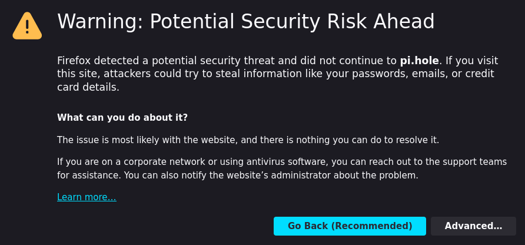

You can avoid this warning by either using your own secure certificate and domain or by adding the certificate to your trusted certificates.

## Adding the CA to your browser

If you want to use the self-signed certificate, you can add the automatically generated certificate authority (CA) to your browser. This will make your browser trust all certificates signed by this CA. This is the same mechanism that is used by your browser to trust certificates signed by a certificate authority like Let's Encrypt. The following instructions show how to add the CA to Firefox and Chrome. The instructions for other browsers are similar.

It is also possible to add the CA to your operating system's certificate store. This will make all applications that use the operating system's certificate store trust the CA. The instructions for this are operating system specific and are not covered here.

Note that you have to add the **CA** certificate (e.g., `/etc/pihole/tls_ca.crt`) and not the server certificate (e.g., `/etc/pihole/tls.pem`).

It is worth noting that the certificate is valid for `pi.hole` and, if you configured one, for your custom `webserver.domain` - but for nothing else, in particular not for your Pi-hole's IP address. If you access the web interface under any other name, you will get a warning because the certificate does not match the domain. You can either add the certificate for the other domain as well or you can create a new certificate for the other domain. You can easily create a new certificate by removing the old certificate and restarting `pihole-FTL` (e.g., `sudo rm /etc/pihole/tls* && sudo service pihole-FTL restart`). This will create a new certificate for the domain configured in `/etc/pihole/pihole.toml` (setting `webserver.domain`).

<!-- markdownlint-disable code-block-style -->
!!! warning "Security warning"
    If you add the CA to your browser, you will trust all certificates signed by this CA. By discarding the CA's private key after certificate creation, the risk of a compromised CA is minimized. However, this also means you need to create (and, in turn, add to your OS or browser) a new CA whenever you change the domain of your Pi-hole installation.

    If you want to revoke the CA certificate itself, you can simply delete it from either your operating system's trust store or the browsers you have added it to at any time.
<!-- markdownlint-enable code-block-style -->

### Firefox (tested with Firefox 121.0)

| Before | After |
| :-----: | :-----: |
| 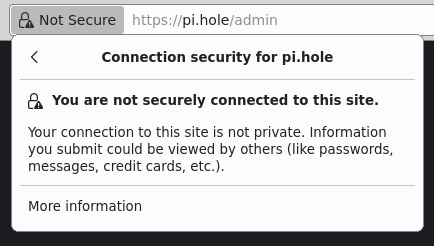 | 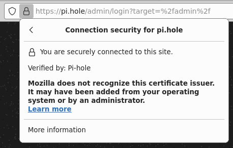 |

1. Open the settings page of Firefox at [about:preferences#privacy](about:preferences#privacy)
2. Search for "Certificates"
    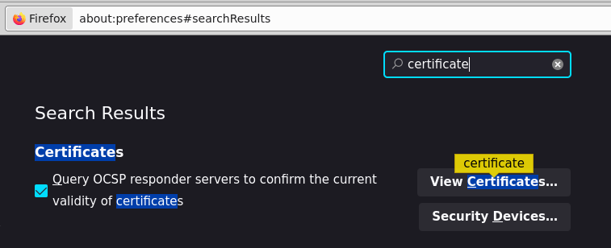
3. Click on "View Certificates"
4. Select the "Authorities" tab
5. Click on "Import" and select the **CA** certificate file (e.g., `/etc/pihole/tls_ca.crt`)
6. Check "Trust this CA to identify websites"
    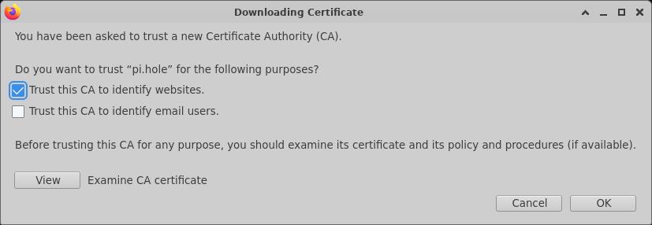
7. Click on "OK"
8. Verify that the certificate has been imported correctly
    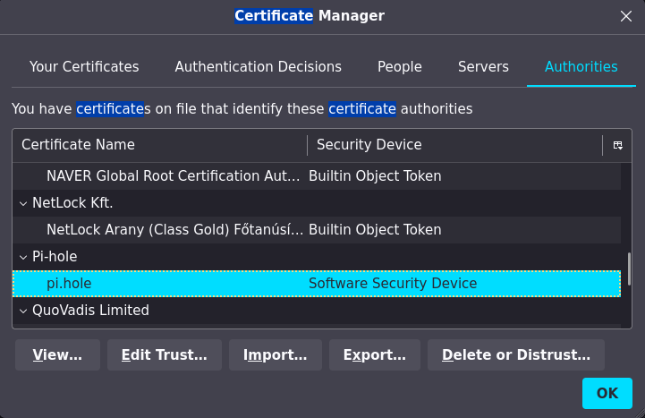
9. Verify that the Pi-hole web interface is now trusted (no warning, secure lock icon)

If the last step did not work, make sure that you have generated the certificate correctly (you may have a mismatch between the configured domain and the domain used by Pi-hole during certificate creation). Also verify that you have imported the **CA** certificate (not the server certificate).

### Chrome (tested with Chrome 120.0)

| Before | After |
| :-----: | :-----: |
| 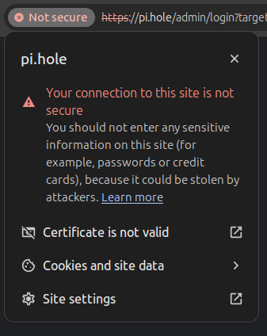 | 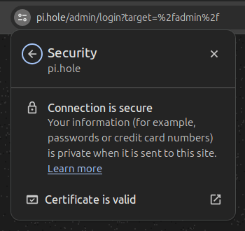 |

1. Open the settings page of Chrome at [chrome://settings/privacy](chrome://settings/privacy)
2. Navigate to "Manage certificates" in the "Security" submenu of "Privacy and security" or use the search bar
    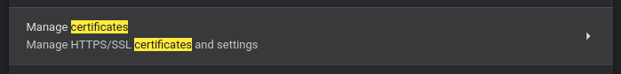
3. Click on "Authorities" tab
4. Click on "Import" and select the **CA** certificate file (e.g., `/etc/pihole/tls_ca.crt`)
5. Check "Trust this certificate for identifying websites"
    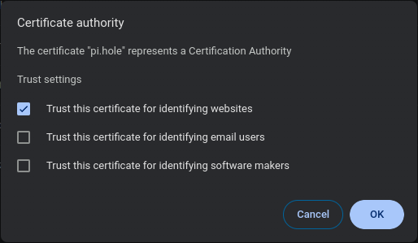
6. Click on "OK"
7. Verify that the certificate has been imported correctly
    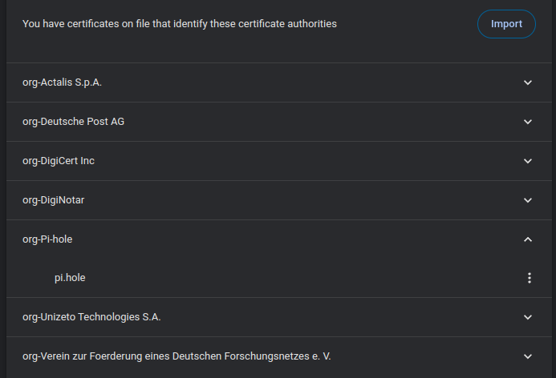
8. Verify that the Pi-hole web interface is now trusted (no warning, secure lock icon)

If the last step did not work, see the remark below the Firefox instructions above.

### Android (tested with Android 11 and Firefox Mobile 121.1.0)

| Before | After |
| :-----: | :-----: |
| 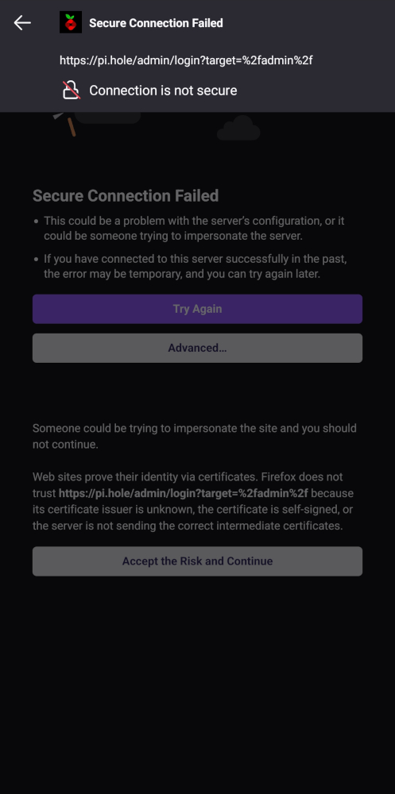 | 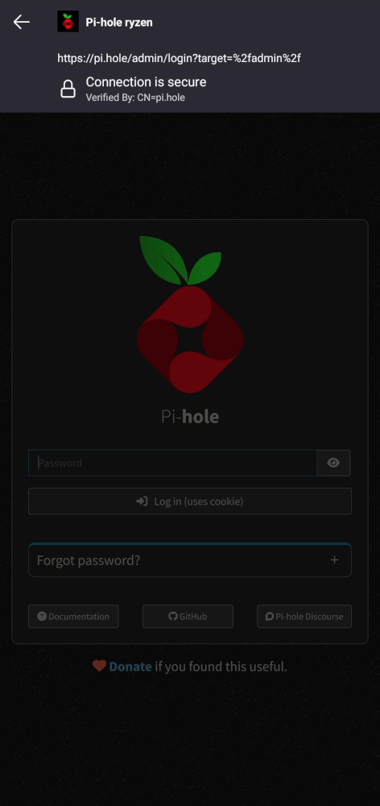 |
| 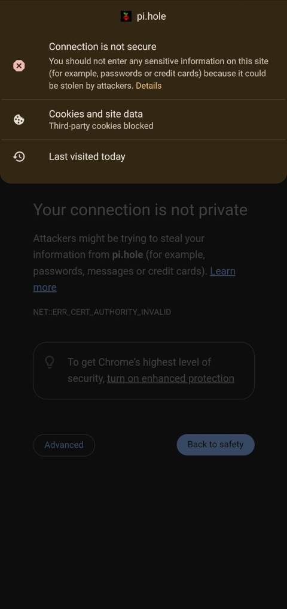 | 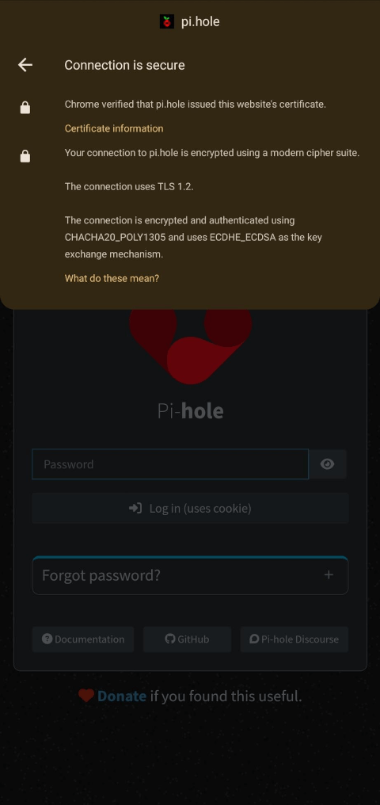 |

1. Go to your device's settings
2. Navigate to "System Security" or "Security & location" (depending on your device)
3. Navigate to "Credential storage" or similar (depending on your device)

    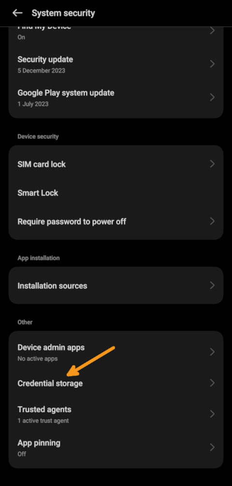

4. Choose "Install certificates from storage" or similar (depending on your device)

    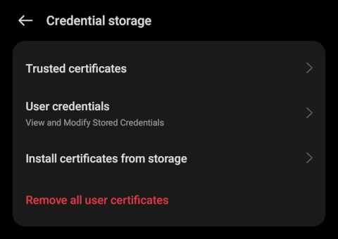

5. Select "User certificates" or similar (depending on your device)

    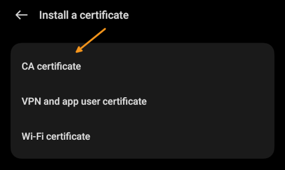

6. Select the **CA** certificate file (e.g., `/etc/pihole/tls_ca.crt`) - you need to have the certificate file on your device (e.g., by copying it to your device via Bluetooth or other *secure* means)

    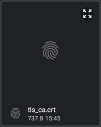

7. Confirm that you want to install the certificate despite the possible security implications mentioned above

    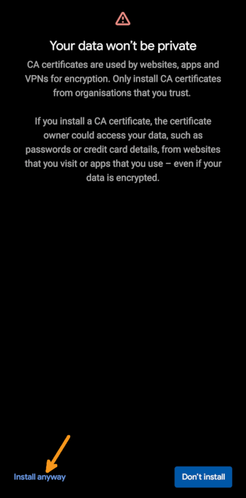

8. Give the certificate a meaningful name (e.g., "Pi-hole")

    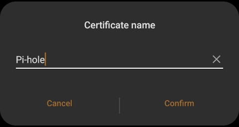

9. Verify that the certificate has been imported correctly by checking for a small success popup in the lower area of the screen

    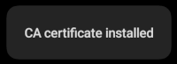

10. Verify that the Pi-hole web interface is now trusted (no warning, secure lock icon)

The certificate will be valid for all apps that use the Android certificate store. This includes the Firefox Mobile browser but also others such as Chrome.

#### Additional steps for recent Firefox Mobile versions (tested with Android 14 and Firefox Mobile 136.0)

On recent versions of the Firefox Android browser (this does not seem necessary with Chrome), you may need to perform the following additional steps to enable the browser to use user-defined certificates:

1. Open Firefox
2. Navigate to "Settings" and then "About Firefox"
3. Tap the Firefox logo five times to unlock the hidden menu
4. Go back to "Settings" and open "Secret Settings"
5. Enable "Use third party CA certificates"

If this still did not work, see the remark below the Firefox instructions above.

## Using your own certificate

If you want to use your own certificate, you can do so by placing the certificate and the private key in a location that can be read by user `pihole` (e.g., `/etc/pihole`) and, change the path in `/etc/pihole/pihole.toml` (setting `webserver.tls.cert`) and restart `pihole-FTL` (e.g., `sudo service pihole-FTL restart`). The certificate and the private key must be in PEM format (check automatically generated certificate for an example).

## Certificate renewal

Certificates Pi-hole generated itself are valid for `webserver.tls.validity` days (47 by default) and are renewed automatically two days before they expire, so `pihole-FTL` never ends up serving an expired certificate.

Renewal creates a *new* certificate authority as well, because the old CA's private key was discarded right after the previous certificate was signed and can no longer sign anything. Every device you added the CA to therefore has to be given the new `/etc/pihole/tls_ca.crt` after each renewal. If you added the CA to your devices, a longer `webserver.tls.validity` means fewer of these rounds - or use a certificate from a public CA instead.

Pi-hole recognizes its own certificates by their common name: both issuer and subject have to read `pi.hole`. A self-signed certificate Pi-hole created for a different `webserver.domain` therefore does *not* qualify - it is treated like a foreign certificate and only logs `is about to expire soon, but it is not a Pi-hole certificate` when the time comes. Renew it by deleting `/etc/pihole/tls*` and restarting `pihole-FTL`.

If you use your own certificate, you have to renew it yourself, and we recommend setting `webserver.tls.validity` to `0` in that case: Pi-hole then leaves that certificate alone entirely and does not track its expiry either, so renewing it in time is up to you. Note that `0` disables renewal, not the initial generation - if the file `webserver.tls.cert` points at does not exist, Pi-hole still creates a self-signed certificate for it, then with a fixed validity of roughly 30 years.

## Supported protocol versions

FTL terminates TLS itself and requires at least TLS 1.2. On encrypted ports it offers HTTP/1.1, HTTP/2 and HTTP/3, negotiated through ALPN - see [Webserver](../ftldns/webserver.md#http2-and-http3) for what that means for your firewall.
