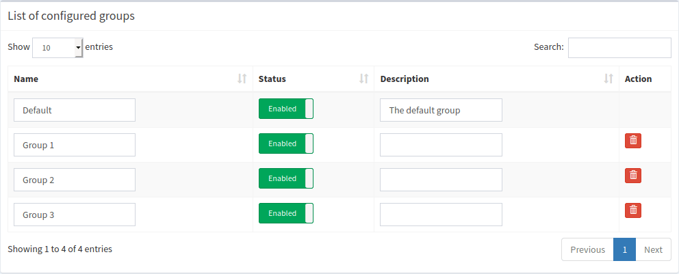
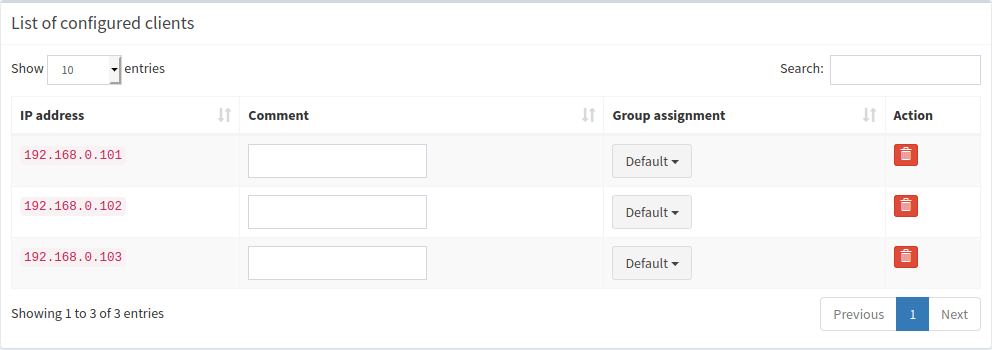
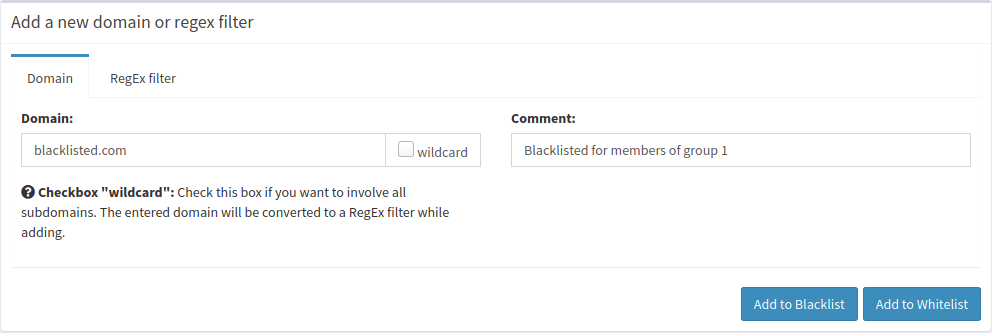
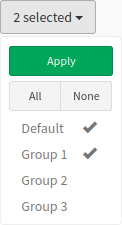

# Per-client blocking example

In this example, we describe how to set up a blocking rule for three specific clients. All remaining (and newly added) clients in the network are "unmanaged", i.e., they use Pi-hole as usual. The examples shown here are built upon each other, i.e., example 5 might make no sense without the context of example 3.

Don't forget to run

```bash
pihole restartdns reload-lists
```

after your database modifications to have FTL flush its internal domain-blocking cache (separate from the DNS cache).

## Prerequisites

1. **Add three groups.**

    The `Default` group has a special meaning and cannot be deleted. All domains, clients, and adlists without a specific group assignment are automatically managed through this group. Disabling this group will disable Pi-hole blocking for all unmanaged devices.

    

    ??? "Raw database instructions"
        ```sql
        INSERT INTO "group" (id, name) VALUES (1, 'Group 1');
        INSERT INTO "group" (id, name) VALUES (2, 'Group 2');
        INSERT INTO "group" (id, name) VALUES (3, 'Group 3');
        ```

2. **Add three clients.**

    Add three clients at your will, their IP addresses might differ from the ones in this example.

    

    ??? "Raw database instructions"
        ```sql
        INSERT INTO client (id, ip) VALUES (1, '192.168.0.101');
        INSERT INTO client (id, ip) VALUES (2, '192.168.0.102');
        INSERT INTO client (id, ip) VALUES (3, '192.168.0.103');
        ```

3. **Link the clients to the created groups.**

    

    ??? "Raw database instructions"
        ```sql
        INSERT INTO client_by_group (client_id, group_id) VALUES (1, 1);
        INSERT INTO client_by_group (client_id, group_id) VALUES (2, 2);
        INSERT INTO client_by_group (client_id, group_id) VALUES (3, 3);
        ```

## Example 1: Exclude from blocking

**Task:** Exclude client 1 from Pi-hole's blocking by removing client 1 from the `Default` group.


??? "Raw database instructions"
    ```sql
    DELETE FROM client_by_group WHERE client_id = 1 AND group_id = 0;
    ```

**Result**

Client        | Group membership | Domain | Blocked
------------- | ----- | ------ | -------
*all other*   |   Default   | doubleclick.net | Yes
192.168.0.101 |   Group 1   | doubleclick.net | **No**
192.168.0.102 |   Group 2 + Default   | doubleclick.net | Yes
192.168.0.103 |   Group 3 + Default   | doubleclick.net | Yes


All three clients got automatically assigned to the default (`Default`) group when they were added. The default group includes all adlists and list domains (if not already changed by the user). When we remove the default group for client `192.168.0.101`, we effectively remove all associations to any adlists and domains. This leaves this client completely unblocked.

## Example 2: Blocklist management

**Task:** Assign adlist with ID 1 to group 1 (in addition to the default assignment to group 0). This results in client `192.168.0.101` using *only this* adlist (we removed the default association in the last step).


??? "Raw database instructions"
    ```sql
    INSERT INTO adlist_by_group (adlist_id, group_id) VALUES (1,1);
    ```

**Result**

Client        | Group membership | Domain | Blocked
------------- | ----- | ------ | -------
*all other*   |   Default   | doubleclick.net | Yes
192.168.0.101 |   Group 1   | doubleclick.net | **Yes**
192.168.0.102 |   Group 2 + Default   | doubleclick.net | Yes
192.168.0.103 |   Group 3 + Default   | doubleclick.net | Yes


`192.168.0.101` gets `doubleclick.net` blocked as it uses an adlist including this domain. All other clients stay unchanged.

## Example 3: Blacklisting

**Task:** Add a single domain that should be **blacklisted only for group 1** (client `192.168.0.101`).

### Step 1

Add the domain to be blocked




??? "Raw database instructions"
    ```sql
    INSERT INTO domainlist (type, domain, comment) VALUES (1, 'blacklisted.com', 'Blacklisted for members of group 1');
    ```

**Result**

Client        | Group membership | Domain | Blocked
------------- | ----- | ------ | -------
*all other*   |   Default   | blacklisted.com | **Yes**
192.168.0.101 |   Group 1   | blacklisted.com | No
192.168.0.102 |   Group 2 + Default   | blacklisted.com | **Yes**
192.168.0.103 |   Group 3 + Default   | blacklisted.com | **Yes**


Note that Pi-hole is *not* blocking this domain for client `192.168.0.101` as we removed the default assignment through group 0 above. All remaining clients are linked through the Default group to this domain and see it as being blocked.

### Step 2

Assign this domain to group 1



??? "Raw database instructions"
    ```sql
    INSERT INTO domainlist_by_group (domainlist_id, group_id) VALUES (1, 1);
    ```
    (the `domainlist_id` might be different for you, check with `SELECT last_insert_rowid();` after step 1)

**Result**

Client        | Group membership | Domain | Blocked
------------- | ----- | ------ | -------
*all other*   |   Default   | blacklisted.com | Yes
192.168.0.101 |   Group 1   | blacklisted.com | **Yes**
192.168.0.102 |   Group 2 + Default   | blacklisted.com | Yes
192.168.0.103 |   Group 3 + Default   | blacklisted.com | Yes

All clients see this domain as being blocked: Client 1 due to a direct assignment through group 1, all remaining clients through the default group 0 (unchanged).

### Step 3

Remove default assignment to all clients not belonging to a group


??? "Raw database instructions"
    ```sql
    DELETE FROM domainlist_by_group WHERE domainlist_id = 1 AND group_id = 0;
    ```
    (the `domainlist_id` might be different for you, see above)

**Result**

Client        | Group membership | Domain | Blocked
------------- | ----- | ------ | -------
*all other*   |   Default   | blacklisted.com | **No**
192.168.0.101 |   Group 1   | blacklisted.com | Yes
192.168.0.102 |   Group 2 + Default   | blacklisted.com | **No**
192.168.0.103 |   Group 3 + Default   | blacklisted.com | **No**

While client 1 keeps its explicit assignment through group 1, the remaining clients lost their unassignments when we removed group 0 from the assignment.

## Example 4: Whitelisting

**Task:** Add a single domain that should be **whitelisted only for group 2** (client `192.168.0.102`).

### Step 1

Add the domain to be whitelisted


??? "Raw database instructions"
    ```sql
    INSERT INTO domainlist (type, domain, comment) VALUES (0, 'doubleclick.net', 'Whitelisted for members of group 2');
    ```

**Result**

Client        | Group membership | Domain | Blocked
------------- | ----- | ------ | -------
*all other*   |   Default   | doubleclick.net | **No**
192.168.0.101 |   Group 1   | doubleclick.net | Yes
192.168.0.102 |   Group 2 + Default   | doubleclick.net | **No**
192.168.0.103 |   Group 3 + Default   | doubleclick.net | **No**

Client `192.168.0.101` is not whitelisting this domain as we removed the default assignment through group 0 above. All remaining clients are linked through the default group to this domain and see it as being whitelisted. Note that this is completely analog to step 1 of [example 3](#example-3-blacklisting).

### Step 2

Remove default group assignment


??? "Raw database instructions"
    ```sql
    DELETE FROM domainlist_by_group WHERE domainlist_id = 2 AND group_id = 0;
    ```

**Result**

Client        | Group membership | Domain | Blocked
------------- | ----- | ------ | -------
*all other*   |   Default   | doubleclick.net | **Yes**
192.168.0.101 |   Group 1   | doubleclick.net | Yes
192.168.0.102 |   Group 2 + Default   | doubleclick.net | **Yes**
192.168.0.103 |   Group 3 + Default   | doubleclick.net | **Yes**

Requests from all clients are blocked as the new whitelist entry is not associated with any group and, hence, is not used by any client.

### Step 3

Assign this domain to group 2


??? "Raw database instructions"
    ```sql
    INSERT INTO domainlist_by_group (domainlist_id, group_id) VALUES (2, 2);
    ```
    (the `domainlist_id` might be different for you, check with `SELECT last_insert_rowid();` after step 1)

**Result**

Client        | Group membership | Domain | Blocked
------------- | ----- | ------ | -------
*all other*   |   Default   | doubleclick.net | Yes
192.168.0.101 |   Group 1   | doubleclick.net | Yes
192.168.0.102 |   Group 2 + Default   | doubleclick.net | **No**
192.168.0.103 |   Group 3 + Default   | doubleclick.net | Yes

Client 2 got the whitelist entry explicitly assigned to. Accordingly, client 2 does not get the domain blocked whereas all remaining clients still see this domain as blocked.
