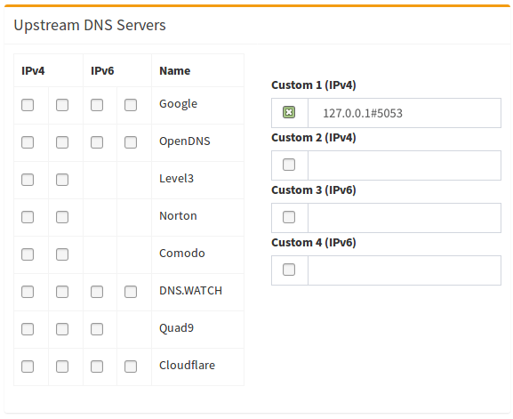

### Why use DNS-Over-HTTPS?

DNS-Over-HTTPS is a protocol for performing DNS lookups via the same protocol you use to browse the web securely: **HTTPS**.

With standard DNS, requests are sent in plain-text, with no method to detect tampering or misbehaviour. This means that not only can a malicous actor look at all the DNS requests you are making (and therefore what websites you are visiting), they can also tamper with the response and redirect your device to resources in their control (such as a fake login page for internet banking).

DNS-Over-HTTPS prevents this by using standard HTTPS requests to retrieve DNS information. This means that the connection from the device to the DNS server is secure and can not easily be snooped, monitored, tampered with or blocked.
It is worth noting however, that the upstream DNS-Over-HTTPS provider will still have this ability.

## Configuring DNS-Over-HTTPS

Along with releasing their DNS service [1.1.1.1](https://blog.cloudflare.com/announcing-1111/), Cloudflare implemented DNS-Over-HTTPS proxy functionality in to one of their tools: `cloudflared`.

In the following sections we will be covering how to install and configure this tool on `Pi-hole`.

### Installing `cloudflared`

The installation is fairly straightforward, and for this guide we will focus on amd64 as our architecture.

#### AMD64 architecture (most devices)

Download the installer package, then use `apt-get` to install the package along with any dependencies. Proceed to run the binary with the `-v` flag to check it is all working.

For this guide, we will be referencing the "latest" .deb binary file for amd64 directly from cloudflared: https://developers.cloudflare.com/argo-tunnel/downloads/ 

```
wget https://bin.equinox.io/c/VdrWdbjqyF/cloudflared-stable-linux-amd64.deb
sudo apt-get install ./cloudflared-stable-linux-amd64.deb
cloudflared -v
```

#### Configuring `cloudflared` to run on startup

Create a cloudflared user to run the daemon.

```
sudo useradd -s /usr/sbin/nologin -r -M cloudflared
```

Proceed to create a configuration file for `cloudflared` by copying the following in to `/etc/default/cloudflared`. This file contains the command-line options that get passed to cloudflared on startup.

```
# Commandline args for cloudflared
CLOUDFLARED_OPTS=--port 5053 --upstream https://1.1.1.1/dns-query --upstream https://1.0.0.1/dns-query
```

Update the permissions for the configuration file and `cloudflared` binary to allow access for the cloudflared user

```
sudo chown cloudflared:cloudflared /etc/default/cloudflared
sudo chown cloudflared:cloudflared /usr/local/bin/cloudflared
```

Then create the `systemd` script by copying the following in to `/lib/systemd/system/cloudflared.service`. This will control the running of the service and allow it to run on startup.

```
[Unit]
Description=cloudflared DNS over HTTPS proxy
After=syslog.target network-online.target

[Service]
Type=simple
User=cloudflared
EnvironmentFile=/etc/default/cloudflared
ExecStart=/usr/local/bin/cloudflared proxy-dns $CLOUDFLARED_OPTS
Restart=on-failure
RestartSec=10
KillMode=process

[Install]
WantedBy=multi-user.target
```

Enable the `systemd` service to run on startup, then start the service and check its status.
```
sudo systemctl enable cloudflared
sudo systemctl start cloudflared
sudo systemctl status cloudflared
```

Now test that it is working! Run the following `dig` command, a response should be returned similar to the one below

```
dig @127.0.0.1 -p 5053 google.com


; <<>> DiG 9.10.3-P4-Ubuntu <<>> @127.0.0.1 -p 5053 google.com
; (1 server found)
;; global options: +cmd
;; Got answer:
;; ->>HEADER<<- opcode: QUERY, status: NOERROR, id: 65181
;; flags: qr rd ra; QUERY: 1, ANSWER: 1, AUTHORITY: 0, ADDITIONAL: 1

;; OPT PSEUDOSECTION:
; EDNS: version: 0, flags:; udp: 1536
;; QUESTION SECTION:
;google.com.			IN	A

;; ANSWER SECTION:
google.com.		299	IN	A	243.65.127.221

;; Query time: 3 msec
;; SERVER: 127.0.0.1#5053(127.0.0.1)
;; MSG SIZE  rcvd: 65
```

### Configuring Pi-hole
Finally, configure Pi-hole to use the local `cloudflared` service as the upstream DNS server:



(don't forget to hit Return or click on `Save`)

### Updating cloudflared install package post install for amd64 architecture (most devices)

### Download and update manually:

Download the  latest installer package, then use `apt-get` to upgrade the package along with any dependencies. Proceed to run the binary with the `-v` flag to check it is all working.

```
sudo apt-get update
wget https://bin.equinox.io/c/VdrWdbjqyF/cloudflared-stable-linux-amd64.deb
sudo apt-get upgrade ./cloudflared-stable-linux-amd64.deb
cloudflared -v
```

### Download and update using apt-get by adding souce to your local repo list:

Referencing cloudflared's repo list, https://pkg.cloudflare.com/, we can use the provided steps to add cloudflared to your local installaiton source. This allows you to update/upgrade clouflared along with your other local packages using apt-get directly.


Add the repository (replace <RELEASE> with the Ubuntu release name):

```
echo 'deb http://pkg.cloudflare.com/ <RELEASE> main' | 
sudo tee /etc/apt/sources.list.d/cloudflare-main.list
```

For example (Xenial):

```
echo 'deb http://pkg.cloudflare.com/ xenial main' | 
sudo tee /etc/apt/sources.list.d/cloudflare-main.list
```

Import GPG key:

```
curl -C - https://pkg.cloudflare.com/pubkey.gpg | sudo apt-key add -
```

Update apt cache:

```
sudo apt-get update
```
Update packages(s):

```
sudo apt-get update
```

Check Version:

```
cloudflared -v
```

(Portions of) [^guide]: Based on [this guide by Ben Dews | bendews.com](https://bendews.com/posts/implement-dns-over-https/)
