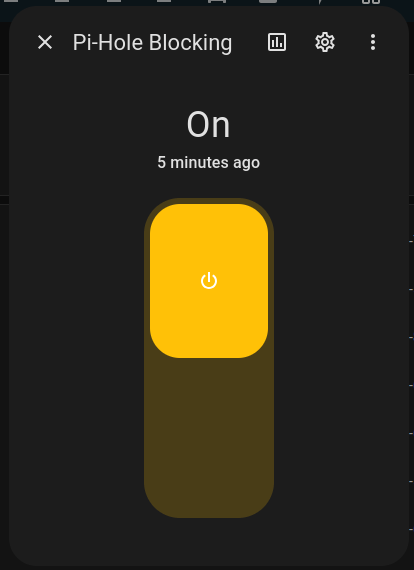
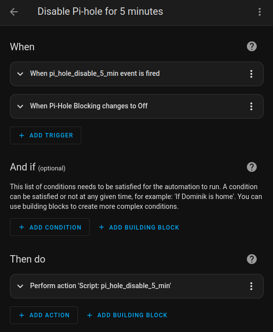

# Automating your Pi-hole with Home Assistant

Home Assistant is an open-source home automation platform. It is able to track and control all devices at home and offer a platform for automating control. This guide will show you some examples how to integrate Pi-hole's API with Home Assistant. Feel free to adapt the examples to your needs.

## Prerequisites

- A running Home Assistant instance
- Pi-hole installed and running

## Example 1: Use a boolean switch to enable/disable Pi-hole blocking
<!-- markdownlint-disable MD032 MD031 -->
1. Add to your [`secrets.yaml`](https://www.home-assistant.io/docs/configuration/secrets/):
   ```yaml
   pi_hole_password: "your_pihole_password"
   pi_hole_api_url: "http://192.168.1.2/api"
   ```
2. Add to your [`configuration.yaml`](https://www.home-assistant.io/docs/configuration/):
   ```yaml
   rest_command:
     pihole_login:
       url: '{{ api_url }}/auth'
       method: POST
       payload: '{ "password" : "{{ password }}" }'
       content_type:  'application/json; charset=utf-8'
       verify_ssl: false
     pihole_logout:
       url: '{{ api_url }}/auth'
       method: DELETE
       verify_ssl: false
       headers:
         sid: "{{ sid }}"
     pihole_set_blocking:
       url: '{{ api_url }}/dns/blocking'
       method: POST
       payload: '{ "blocking" : {{ blocking }}, "timer" : {{ timer }} }'
       content_type:  'application/json; charset=utf-8'
       verify_ssl: false
       headers:
         sid: "{{ sid }}"

   input_boolean:
     pihole_blocking:
       name: Pi-Hole Blocking
       initial: on
       icon: mdi:block-helper
   ```
3. Add to your [`scripts.yaml`](https://www.home-assistant.io/docs/scripts/):
   ```yaml
   pi_hole_disable:
     sequence:
       - action: rest_command.pihole_login
         data:
           api_url: !secret pi_hole_api_url
           password: !secret pi_hole_password
         response_variable: response
       - condition: template
         value_template: "{{ response['status'] == 200 }}"
       - variables:
           sid: "{{ response['content']['session']['sid'] }}"
       - action: rest_command.pihole_set_blocking
         data:
           api_url: !secret pi_hole_api_url
           sid: "{{ sid }}"
           blocking: "false"
           timer: "300" # can be "null" for permanent
       - action: rest_command.pihole_logout
         data:
           api_url: !secret pi_hole_api_url
           sid: "{{ sid }}"

   pi_hole_enable:
     sequence:
       - action: rest_command.pihole_login
         data:
           password: !secret pi_hole_password
           api_url: !secret pi_hole_api_url
         response_variable: response
       - condition: template
         value_template: "{{ response['status'] == 200 }}"
       - variables:
           sid: "{{ response['content']['session']['sid'] }}"
       - action: rest_command.pihole_set_blocking
         data:
           api_url: !secret pi_hole_api_url
           sid: "{{ sid }}"
           blocking: "true"
           timer: "null"
       - action: rest_command.pihole_logout
         data:
           api_url: !secret pi_hole_api_url
           sid: "{{ sid }}"
   ```
4. Add to your [`automations.yaml`](https://www.home-assistant.io/docs/automation/):
   ```yaml
   - id: '1734339971405'
     alias: Disable Pi-hole Blocking
     description: ''
     triggers:
     - trigger: event
       event_type: pi_hole_disable
     - entity_id: input_boolean.pihole_blocking
       to: 'off'
       trigger: state
     conditions: []
     actions:
     - action: script.pi_hole_disable
       data: {}
     mode: single
   - id: '1734339971406'
     alias: Enable Pi-hole Blocking
     description: ''
     triggers:
     - trigger: event
       event_type: pi_hole_enable
     - entity_id: input_boolean.pihole_blocking
       to: 'off'
       trigger: state
     conditions: []
     actions:
     - action: script.pi_hole_enable
       data: {}
     mode: single
   ```

You can use the created `input_boolean.pihole_blocking` to enable or disable Pi-hole blocking



The `pi_hole_disable` script will disable Pi-hole blocking for 5 minutes, while the `pi_hole_enable` script will enable Pi-hole blocking permanently. We created two automations to trigger the scripts based on the state of the `input_boolean.pihole_blocking`, e.g., when the boolean is turned off, the `pi_hole_disable` script will be triggered:



This automation may be enriched with additional triggers, e.g., automatically disable Pi-hole blocking when changing the color of a specific light to red and re-enable it when the light is turned back to green. You can also add a notification to inform you about the change.

Note that this example does not check the status of Pi-hole before enabling or disabling blocking, i.e., in the mentioned example of a lamp changing color, the lamp will *not* change its color if Pi-hole's blocking state is changed elsewhere, e.g., from the web interface or the CLI.
