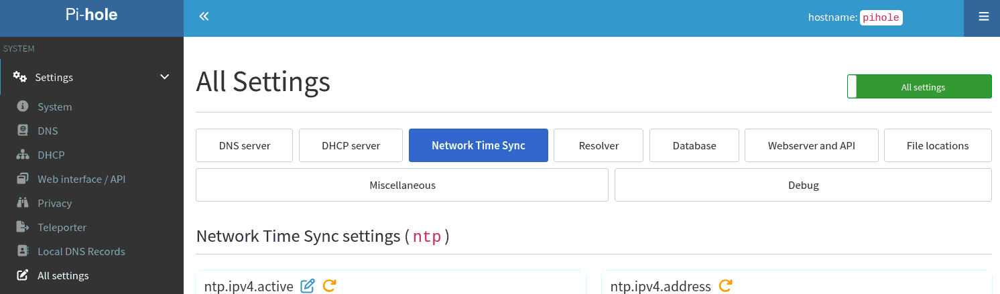

# Configuring NTP (Network Time Protocol) on your Pi-hole

## What is NTP?

Network Time Protocol (NTP) is used to synchronise the clocks of devices on a network, ensuring they report the same time. In a home network, NTP helps keep computers, routers, and iot/smart devices running on the same time, ensuring consistency between scheduling events, logging activities, and within  time-sensitive applications. It works by connecting to time servers on the internet, which provide accurate time based on atomic clocks. A server on your own network can then relay the information to devices on your network. Operating your own server minimises external traffic and helps keep the time consistent across your devices.

# Configuring Pi-hole's NTP client and server

Settings relating to NTP are in the "Network Time Sync" tab of the All Settings page. If All Settings is not visible, click where it says "Basic" at the top right to toggle the Expert settings, and All Settings will become visible in the Settings section.

## Client settings

Pi-hole acts as an NTP client, synchronising the time on your Raspberry Pi or other system with that provided by a reliable online source. Having the correct time ensures that certificates fall within their valid time frame, allowing protocols such as DNSSEC to work effectively.

The NTP client is enabled by default, but can be disabled by deselecting `ntp.sync.active`

### Upstream NTP Server

You can specify the server you wish to synchronise with at `ntp.sync.server`

The default server is `pool.ntp.org`, which selects a server from the [NTP pool project](https://www.ntppool.org), a virtual cluster of timeservers providing reliable, easy to use NTP service. The NTP Pool is generally of very high quality, but it is a service run by volunteers in their spare time.

Other public ntp servers include
[`time.cloudflare.com`](https://www.cloudflare.com/time/), [`time.facebook.com`](https://engineering.fb.com/production-engineering/ntp-service/) and [`time.google.com`](https://developers.google.com/time/)

If your ISP provides an NTP server (or if there is an NTP server on your network), you may enter its address here.

Typically the closer you are to the server there will be less network jitter, and you will be able to obtain a more accurate time.

### Synchronisation frequency

The frequency that Pi-hole queries the server is set at `ntp.sync.interval`, and the number of readings compared at each synchronisation is set at `ntp.sync.count`

By default this is set to `3600` seconds, so that Pi-hole will synchronise the time once every hour, taking the average of `8` readings.

If there is an NTP server on your network, the time between queries can be decreased here.

If you are using a public time server, note that querying excessively violates the terms of use of many public servers, and could result in your IP being banned.

## Server settings

Pi-hole acts as an NTP server, allowing other devices on your network to synchronise their time with it. This passes along the accurate time that was obtained over the internet.

The NTP server is enabled by default, but can be disabled by deselecting `ntp.ipv4.active` and `ntp.ipv6.active`.

### Listening addresses

By default, Pi-hole will respond to NTP requests on all addresses. The Pi-hole NTP server can be restricted to listening to a single address, which may be specified by `ntp.ipv4.address` and `ntp.ipv6.address`.

## Real time clock (RTC) synchronisation

Pi-hole is able to set the time of the hardware real time clock, if present. This makes the time more accurate immediately after reboot. Note that not all devices are fitted with hardware clocks, Raspberry Pis in particular do not ship with a hardware clock.

This is enabled by the setting `ntp.sync.rtc.set`.

### RTC location

The path to the real time clock can be specified at `ntp.sync.rtc.device`.

## Advertising Pi-hole's NTP server to devices on your network

If Pi-hole is also operating as a DHCP server, it will also advertise the presence of your NTP server to devices on your network when it gives them their address.

Note that not all client devices are able to make use of this feature, and may need to be configured manually.
