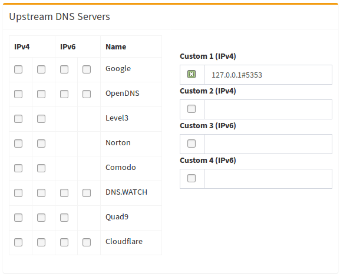

### The problem: Whom can you trust?
Pi-hole includes a caching and *forwarding* DNS server, now known as *FTL*DNS. After applying the blocking lists, it forwards requests made by the clients to configured upstream DNS server(s). However, as has been mentioned by several users in the past, this leads to some privacy concerns as it ultimately raises the question: _Whom can you trust?_ Recently, more and more small (and not so small) DNS upstream providers have appeared on the market, advertising free and private DNS service, but how can you know that they keep their promises? Right, you can't.

Furthermore, from the point of an attacker, the DNS servers of larger providers are very worthwhile targets, as they only need to poison one DNS server, but millions of users might be affected. Instead of your bank's actual IP address, you could be sent to a phishing site hosted on some island. This scenario has [already happened](https://www.zdnet.com/article/dns-cache-poisoning-attacks-exploited-in-the-wild/) and it isn't unlikely to happen again...

When you operate your own (tiny) recursive DNS server, then the likeliness of getting affected by such an attack is greatly reduced.

### What *is* a recursive DNS server?
The first distinction we have to be aware of is whether a DNS server is *authoritative* or not.  If I'm the authoritative server for, e.g., `pi-hole.net`, then I know which IP is the correct answer for a query. Recursive name servers, in contrast, resolve any query they receive by consulting the servers authoritative for this query by traversing the domain.
Example: We want to resolve `pi-hole.net`. On behalf of the client, the recursive DNS server will traverse the path of the domain across the Internet to deliver the answer to the question.

### What does this guide provide?
In only a few simple steps, we will describe how to set up your own recursive DNS server. It will run on the same device you're already using for your Pi-hole. There are no additional hardware requirements.

This guide assumes a fairly recent Debian/Ubuntu based system and will use the maintainer provided packages for installation to make it an incredibly simple process. It assumes only very basic knowledge of how DNS works.

A _standard_ Pi-hole installation will do it as follows:

1. Your client asks the Pi-hole `Who is pi-hole.net`?
2. Your Pi-hole will check its cache and reply if the answer is already known.
3. Your Pi-hole will check the blocking lists and reply if the domain is blocked.
4. Since neither 2. nor 3. is true in our example, the Pi-hole forwards the request to the configured *external* upstream DNS server(s).
5. Upon receiving the answer, your Pi-hole will reply to your client and tell it the answer of its request.
6. Lastly, your Pi-hole will save the answer in its cache to be able to respond faster if *any* of your clients queries the same domain again.

After you set up your Pi-hole as described in this guide, this procedure changes notably:

1. Your client asks the Pi-hole `Who is pi-hole.net`?
2. Your Pi-hole will check its cache and reply if the answer is already known.
3. Your Pi-hole will check the blocking lists and reply if the domain is blocked.
4. Since neither 2. nor 3. is true in our example, the Pi-hole delegates the request to the (local) recursive DNS resolver.
5. Your recursive server will send a query to the DNS root servers: "Who is handling `.net`?"
6. The root server answers with a referral to the TLD servers for `.net`.
7. Your recursive server will send a query to one of the TLD DNS servers for `.net`: "Who is handling `pi-hole.net`?"
8. The TLD server answers with a referral to the authoritative name servers for `pi-hole.net`.
9. Your recursive server will send a query to the authoritative name servers: "What is the IP of `pi-hole.net`?"
10. The authoritative server will answer with the IP address of the domain `pi-hole.net`.
11. Your recursive server will send the reply to your Pi-hole which will, in turn, reply to your client and tell it the answer of its request.
12. Lastly, your Pi-hole will save the answer in its cache to be able to respond faster if *any* of your clients queries the same domain again.

You can easily imagine even longer chains for subdomains as the query process continues until your recursive resolver reaches the authoritative server for the zone that contains the queried domain name. It is obvious that the methods are very different and the own recursion is more involved than "just" asking some upstream server. This has benefits and drawbacks:

- Benefit: Privacy - as you're directly contacting the responsive servers, no server can fully log the exact paths you're going, as e.g. the Google DNS servers will only be asked if you want to visit a Google website, but not if you visit the website of your favorite newspaper, etc.

- Drawback: Traversing the path may be slow, especially for the first time you visit a website - while the bigger DNS providers always have answers for commonly used domains in their cache, you will have to transverse the path if you visit a page for the first time time. A first request to a formerly unknown TLD may take up to a second (or even more if you're also using DNSSEC). Subsequent requests to domains under the same TLD usually complete in `< 0.1s`.
Fortunately, both your Pi-hole as well as your recursive server will be configured for efficient caching to minimize the number of queries that will actually have to be performed.

## Setting up Pi-hole as a recursive DNS server solution
We will use [`unbound`](https://www.unbound.net/), a secure open source recursive DNS server primarily developed by NLnet Labs, VeriSign Inc., Nominet, and Kirei.
The first thing you need to do is to install the recursive DNS resolver:
```bash
sudo apt install unbound
```

### Configure `unbound`
Highlights:
- Listen only for queries from the local Pi-hole installation (on port 10053)
- Listen for both UDP and TCP requests
- Verify DNSSEC signatures, discarding BOGUS domains
- Apply a few security and privacy tricks

 `/etc/unbound/unbound.conf.d/pi-hole.conf`:
```ini
server:
    # One thread should be sufficient, can be increased on beefy machines. In reality for most users running on small networks or on a single machine it should be unnecessary to seek performance enhancement by increasing num-threads above 1.
    num-threads: 1

    # If no logfile is specified, syslog is used
    # logfile: "/var/log/unbound/unbound.log"
    verbosity: 0

    # Ensure Unbound is running on loopback interface
    interface: 127.0.0.1@53

    # Use an unassigned port
    port: 10053

    do-ip4: yes
    do-udp: yes
    do-tcp: yes

    # May be set to yes if you have IPv6 connectivity
    do-ip6: no

    # Access control to prevent access from non local network devices
    # Block all
    access-control: 0.0.0.0/0 refuse
    access-control: ::0/0 refuse
    # Allow lo0
    access-control: 127.0.0.0/8 allow
    access-control: ::1 allow
    # Allow lan
    access-control: 192.168.0.0/16 allow
    access-control: 172.16.0.0/12 allow
    access-control: 10.0.0.0/8 allow
    access-control: fd80:1fe9:fcee::/48 allow

    # Prints one line per query to the log, making the server (significantly) slower
    #log-queries: no

    # Prevent banner disclosure
    hide-identity: yes
    hide-version: yes
    # Refuse trustanchor.unbound queries
    hide-trustanchor: yes

    # The maximum dependency depth that Unbound will pursue in answering a query (reduced memory)
    target-fetch-policy: "2 1 0 0 0 0"

    harden-short-bufsize: yes
    harden-large-queries: yes

    # Use 0x20-encoded random bits in the query to foil spoof attempts
    use-caps-for-id: yes

    # DNSSEC bogus answers against DNS Rebinding
    # RFC1918 private IP address space not allowed to be returned for public internet names
    private-address: 192.168.0.0/16
    private-address: 172.16.0.0/12
    private-address: 10.0.0.0/8
    private-address: 169.254.0.0/16
    private-address: fd00::/8
    private-address: fe80::/10
    # Turning on 127.0.0.0/8 would hinder many spamblocklists as they use that
    #private-address: 127.0.0.0/8
    # Adding ::ffff:0:0/96 stops IPv4-mapped IPv6 addresses from bypassing the filter
    private-address: ::ffff:0:0/96
    # add 
    private-address: 2001:470:b35c::/48

    unwanted-reply-threshold: 10000000

    do-not-query-localhost: no

    # Affects buffer space
    #prefetch: no

    # UDP EDNS reassembly buffer advertised to peers. Default 4096.
    # May need lowering on broken networks with fragmentation/MTU issues,
    # particularly if validating DNSSEC.
    #
    #edns-buffer-size: 1480

    # Use TCP for "forward-zone" requests. Useful if you are making
    # DNS requests over an SSH port forwarding.
    #
    #tcp-upstream: yes

    # DNS64 options, synthesizes AAAA records for hosts that don't have
    # them. For use with NAT64 (PF "af-to").
    #
    #module-config: "dns64 validator iterator"
    #dns64-prefix: 64:ff9b::/96 # well-known prefix (default)
    #dns64-synthall: no

    # Validation failure log level 2: query, reason, and server
    val-log-level: 2

    # Synthesise NXDOMAIN from nsec/nsec3 without hitting the authoritative
    aggressive-nsec: yes

    # Local copy of the full root zone, fallback to resolving from root servers
    # "get off my lawn: if a lot of people were doing this it could considerably
    # reduce the load on root nameservers and could increase resiliency in case of
    # a dDOS attack on the root zone" --Florian Obser
    # https://tools.ietf.org/html/draft-ietf-dnsop-7706bis-01
    # https://github.com/wkumari/draft-kh-dnsop-7706bis/pull/8
    auth-zone:
        name: "."
        zonefile: /var/lib/unbound/root.zone
        master: 199.9.14.201        # b.root-servers.net
        master: 2001:500:200::b     # b.root-servers.net
        master: 192.33.4.12     # c.root-servers.net
        master: 2001:500:2::c       # c.root-servers.net
        master: 199.7.91.13     # d.root-servers.net
        master: 2001:500:2d::d      # d.root-servers.net
        master: 192.5.5.241     # f.root-servers.net
        master: 2001:500:2f::f      # f.root-servers.net
        master: 192.112.36.4        # g.root-servers.net
        master: 2001:500:12::d0d    # g.root-servers.net
        master: 193.0.14.129        # k.root-servers.net
        master: 2001:7fd::1     # k.root-servers.net
        master: 192.0.32.132        # xfr.lax.dns.icann.org
        master: 2620:0:2d0:202::132 # xfr.lax.dns.icann.org
        master: 192.0.47.132        # xfr.cjr.dns.icann.org
        master: 2620:0:2830:202::132    # xfr.cjr.dns.icann.org
        fallback-enabled: yes
        for-downstream: no
```

Start your local recursive server and test that it's operational:
```
sudo service unbound start
dig pi-hole.net @127.0.0.1 -p 10053
```
The first query may be quite slow, but subsequent queries, also to other domains under the same TLD, should be fairly quick.

### Test validation
You can test DNSSEC validation using
```
dig sigfail.verteiltesysteme.net @127.0.0.1 -p 10053
dig sigok.verteiltesysteme.net @127.0.0.1 -p 10053
```
The first command should give a status report of `SERVFAIL` and no IP address. The second should give `NOERROR` plus an IP address.

### Configure Pi-hole
Finally, configure Pi-hole to use your recursive DNS server:



(don't forget to hit Return or click on `Save`)
