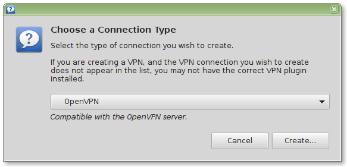
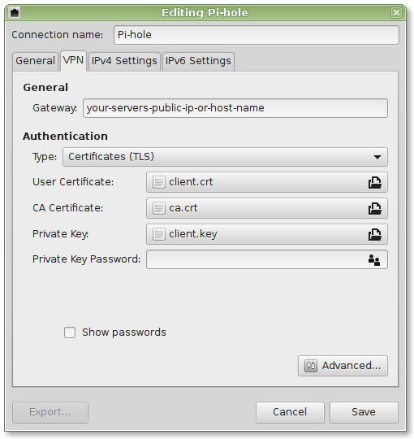
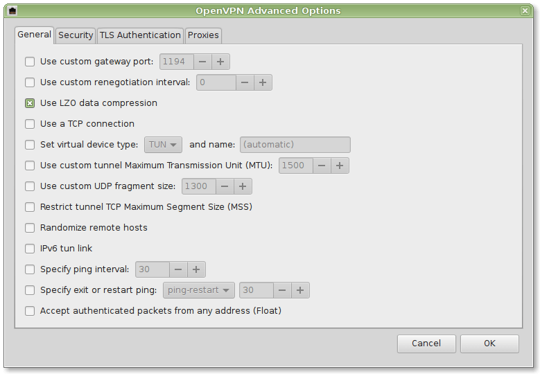
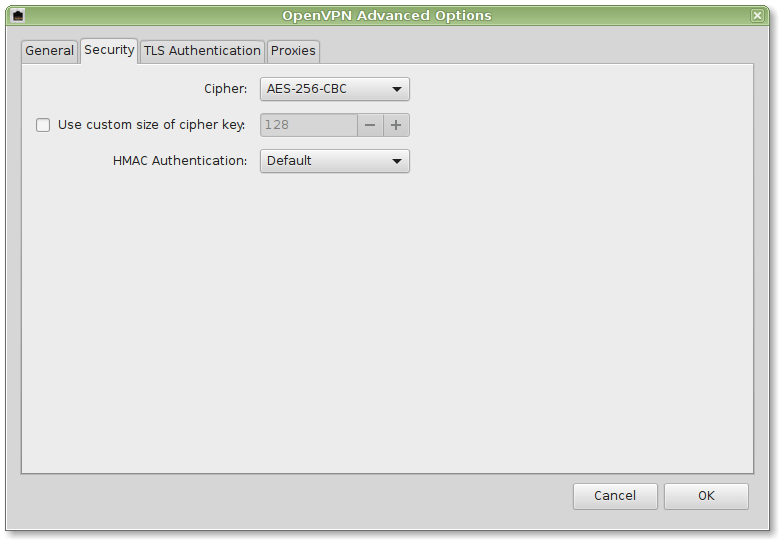
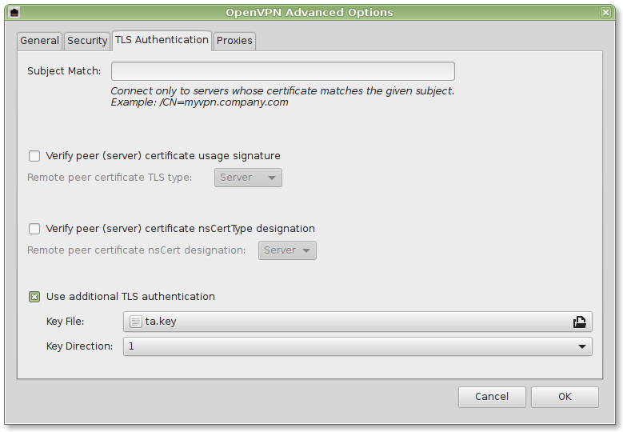

### Connect from a client
There are various tutorials available for all operating systems for how to connect to an OpenVPN server.

### Create certificate
Log into your OpenVPN server and use the road warrior installer to create a new certificate for your client:
```
bash openvpn-install.sh 
```

```
Looks like OpenVPN is already installed

What do you want to do?
   1) Add a cert for a new user
   2) Revoke existing user cert
   3) Remove OpenVPN
   4) Exit
Select an option [1-4]: 1

Tell me a name for the client cert
Please, use one word only, no special characters
Client name: android
Generating a 2048 bit RSA private key
.....+++
..................................+++
writing new private key to '...'
-----
Using configuration from /etc/openvpn/easy-rsa/openssl-1.0.cnf
Check that the request matches the signature
Signature ok
The Subject's Distinguished Name is as follows
commonName            :ASN.1 12:'android'
Certificate is to be certified until Jan 25 15:07:37 2027 GMT (3650 days)

Write out database with 1 new entries
Data Base Updated

Client android added, configuration is available at /root/android.ovpn
```

**WARNING** Anyone who gets his hands on this configuration/certificate file can obtain full access to your VPN. Make sure that you use only trusted paths for transferring the file (e.g. *never* send it via an un-encrypted channel, e.g. email or FTP). Best strategy is to use an USB thumb drive to avoid any network transport at all. Make sure to delete the certificate on the USB drive afterwards.

**NOTICE** If one of your certificates has been compromised, remove it using option `2` (see above) and generate a new certificate. This will effectively lock out anyone who might have gotten access to the certificate.

### Linux
I'll demonstrate the procedure here for Ubuntu Linux (which trivially extends to Linux Mint, etc.)

1. Install the necessary network-manager plugins
```
sudo apt-get install network-manager-openvpn network-manager-openvpn-gnome
sudo service network-manager restart
```

2. Securely copy the necessary certificates from your OpenVPN server to your client (e.g. using `sftp`). They are located in `/etc/openvpn/easy-rsa/pki`

You will need:

* User Certificate: `/etc/openvpn/easy-rsa/pki/issued/client.crt`
* CA Certificate: `/etc/openvpn/easy-rsa/pki/ca.crt`
* Private Key: `/etc/openvpn/easy-rsa/pki/private/client.key`
* Private Key Password: Depending on your settings (might even be empty)
* TA Key: `/etc/openvpn/ta.key`

Further details can be found in the screenshots provided below:






Your whole network traffic will now securely be transferred to your Pi-hole.


### Windows

You will have to install additional software. See https://openvpn.net/index.php/open-source/downloads.html