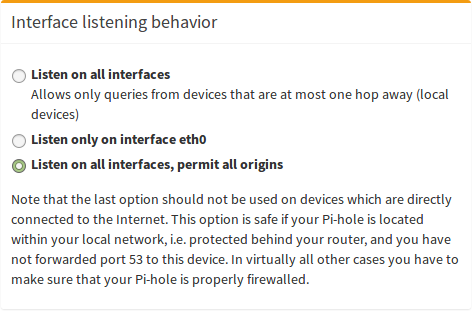

**Up until now, this wiki has been about a server set up on a cloud host, available on the public Internet.  This section is aimed at a server setup in a private network like on a Raspberry Pi.**

So if blocking works using `eth0` but stops working for `tun0`, as described [here](https://github.com/pi-hole/pi-hole/issues/1553), you may want to run this command `pihole -a -i all`, which should get the behaviour you want by opening dnsmasq up to listen on all ports. This is not recommended for cloud servers as they should _not_ be listening on `eth0`.

If you want to set up your Pi-hole + OpenVPN such that you can use from both internal ((W)LAN) and external (VPN) networks, you have to apply some small changes. As additional benefit, you will be able to reach all devices in the internal network (e.g. computers, networking-aware printers, etc.) through the VPN.

This setup assumes that your local network is in the range **192.168.2.0** (i.e. device addresses are in the range of 192.168.2.1 - 192.168.2.254). If this is not the case for you, you have to adjust the settings, accordingly, e.g.

- devices in 192.168.0.1 - 192.168.0.254 -> `route 192.168.0.0`
- devices in 192.168.123.1 - 192.168.123.254 -> `route 192.168.123.0`

Edit your `/etc/openvpn/server.conf`:

```
push "route 192.168.2.0 255.255.255.0"
push "dhcp-option DNS 192.168.2.123"
```

As you can see, we change the address of the DNS server to the local IP address of our Pi-hole (which is **192.168.2.123** in this example).

Afterwards, we change the interface of `Pi-hole` to `eth0` (your local network adapter instead of the VPN adapter `tun0`). This can conveniently be done by using `pihole -r` + `Reconfigure`.

After a restart of the OpenVPN server, all clients should be able to see all devices within your (at home) local network. This is an example running on a distant server, which is connected through the VPN and can successfully communicate with all internal devices:

```
me@client ~ $ ifconfig
eth0      Link encap:Ethernet  HWaddr e0:xx:xx:xx:xx:xx  
          inet addr:134.x.x.x  Bcast:134.x.x.x  Mask:255.x.x.x
          inet6 addr: X:X:X:X::X/64 Scope:Link
          UP BROADCAST RUNNING MULTICAST  MTU:1500  Metric:1
          RX packets:3623911 errors:0 dropped:0 overruns:0 frame:0
          TX packets:2803670 errors:0 dropped:0 overruns:0 carrier:0
          collisions:0 txqueuelen:1000 
          RX bytes:1921375471 (1.9 GB)  TX bytes:1227835028 (1.2 GB)

lo        Link encap:Local Loopback  
          inet addr:127.0.0.1  Mask:255.0.0.0
          inet6 addr: ::1/128 Scope:Host
          UP LOOPBACK RUNNING  MTU:65536  Metric:1
          RX packets:553426 errors:0 dropped:0 overruns:0 frame:0
          TX packets:553426 errors:0 dropped:0 overruns:0 carrier:0
          collisions:0 txqueuelen:1 
          RX bytes:113417383 (113.4 MB)  TX bytes:113417383 (113.4 MB)

tun0      Link encap:UNSPEC  HWaddr 00-00-00-00-00-00-00-00-00-00-00-00-00-00-00-00  
          inet addr:10.8.0.2  P-t-P:10.8.0.2  Mask:255.255.255.0
          UP POINTOPOINT RUNNING NOARP MULTICAST  MTU:1500  Metric:1
          RX packets:274676 errors:0 dropped:0 overruns:0 frame:0
          TX packets:331178 errors:0 dropped:0 overruns:0 carrier:0
          collisions:0 txqueuelen:100 
          RX bytes:43745313 (43.7 MB)  TX bytes:43956250 (43.9 MB)

me@client ~ $ ping 192.168.2.123
PING 192.168.2.123 (192.168.2.123) 56(84) bytes of data.
64 bytes from 192.168.2.123: icmp_seq=1 ttl=64 time=18.9 ms
64 bytes from 192.168.2.123: icmp_seq=2 ttl=64 time=18.9 ms
64 bytes from 192.168.2.123: icmp_seq=3 ttl=64 time=18.9 ms
64 bytes from 192.168.2.123: icmp_seq=4 ttl=64 time=18.7 ms
64 bytes from 192.168.2.123: icmp_seq=5 ttl=64 time=18.7 ms
64 bytes from 192.168.2.123: icmp_seq=6 ttl=64 time=19.0 ms
^C
--- 192.168.2.123 ping statistics ---
6 packets transmitted, 6 received, 0% packet loss, time 5007ms
rtt min/avg/max/mdev = 18.740/18.894/19.017/0.189 ms
```

If you however want to run two VPN servers, one that routes the traffic (with the above settings) and one that answers only to DNS requests, you would have to create another instance of OpenVPN.

Why would you want to do this? 

Because DNS is restricted to port 53 only, you cannot use it as your own DNS outside your network unless you make it public and making a DNS server a public server, is not always the best idea and it comes with some risks. 

So why not use the VPN tunnel to answer to DNS queries only? No traffic goes through it, except for the DNS queries, that are answered (and tracked if you have the Admin interface installed) by your Pi-hole.

You can even use the same .ovpn file, with minor modifications (no need to generate it again).

We're going to use the original configuration file and copy it and then, edit the second file:

`sudo cp /etc/openvpn/server.conf /etc/openvpn/server2.conf`
`sudo nano /etc/openvpn/server2.conf`

We'll need to change the port to a diferent one from the original, so that it does not conflict with the first instance of OpenVPN

Assuming you used default port configuration, you should have 1194 as the port.
You need to change this do a different value (make sure the port is available - 1195 should be) and if needed, port forward it from your router into your device.
You also need to assign a different class of IPs that will server for this connection only (server line).

`server 10.9.0.0 255.255.255.0`
And make sure that the DNS requests go though the instance of OpenVPN:
`push "dhcp-option DNS 10.8.0.1"`

One other setting that we need to change is comment out (the already existing line)  `# push "redirect-gateway def1 bypass-dhcp"`
Save the file and run the second instance of VPN:

`systemctl start openvpn@server2.service`

If your distro doesn’t have “Systemctl” you may use commands like below to start your OpenVPN with your second configuration as a daemon:
`/usr/sbin/openvpn --daemon --writepid /var/run/openvpn/server2.pid --cd /etc/openvpn --config server2.conf --script-security 2`

The next ste is to edit the exisitng .ovpn file that is used for this connection.

When editing the file, update the port from the provious value, to the port you set-up for the second instance of OpenVPN configuration file.

Before testing, make sure you:
1. have the port forwarded to the second instance of VPN
2. `ps ax | grep openvpn` should show you two instances of openvpn running (with different configs)
3. you modified the ovpn file and loaded it onto the client.

**Note, when connected to your secondary VPN connection (the DNS only one), you will not get a pi-hole splash page when accessing a blocked domain directly. The page will not load or it will load with an error, and that's because we didn't route the traffic through the vpn and we didn't create an iptables rule for masquerading, so the return packets (since they are not part of the same LAN subset as your VPN-CLient-AssignedIps) get lost.

### Important last step
The undocumented `pihole -a -i all` command is simply what runs when you choose _Listen on all interfaces, permit all origins (make sure your Pi-hole is firewalled)_, which if you've read this far in the tutorial, you should understand that we don't want you to knowingly or unknowing set up an open resolver.

