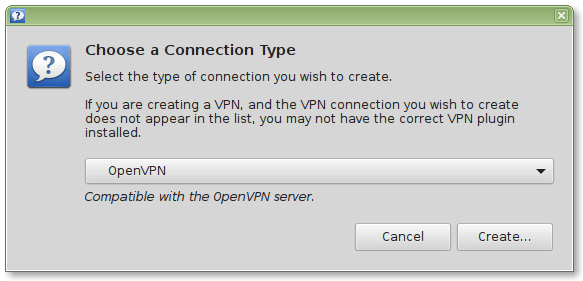
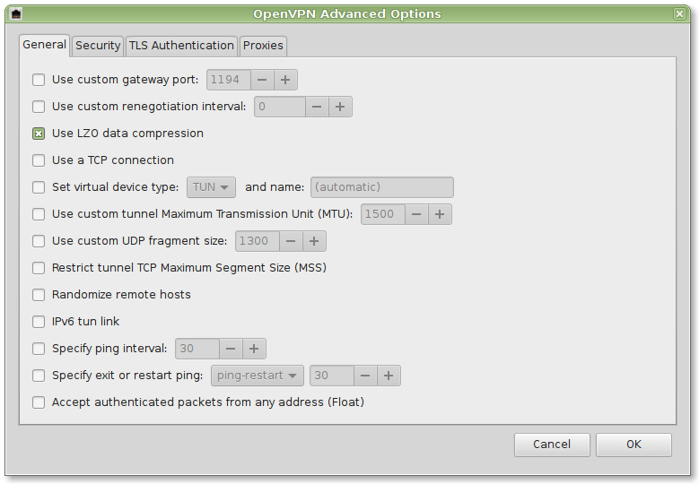
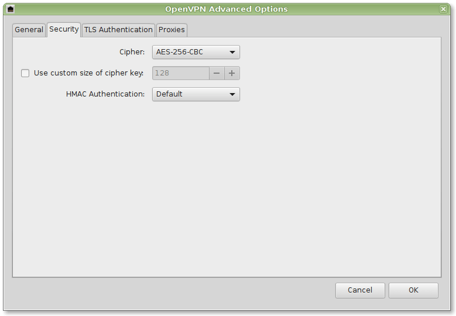
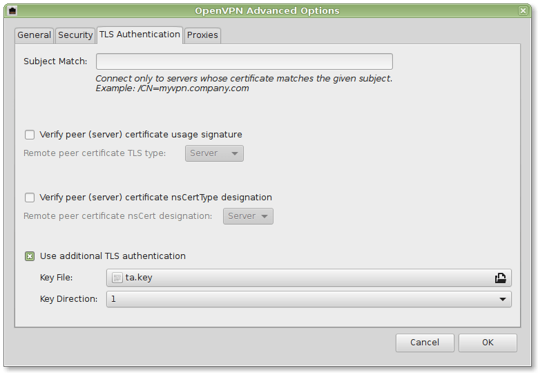

{!guides/vpn/openvpn/deprecation_notice.md!}

## Create a client config file (`.ovpn`)

Now that the server is configured, you'll want to connect some clients so you can make use of your Pi-hole wherever you are. Doing so requires the use of a certificate. You generate these and the resulting `.ovpn` file by running the installer and choosing `1) Add a new user` for each client that will connect to the VPN.

You can repeat this process for as many clients as you need. In this example, we'll "Add a new user" by naming the `.ovpn` file the same as the client's hostname but you may want to adopt your own naming strategy.

Run the OpenVPN installer again

```bash
./openvpn-install.sh
```

Choose `1) Add a new user` and enter a client name

```text
Looks like OpenVPN is already installed

What do you want to do?
   1) Add a new user
   2) Revoke an existing user
   3) Remove OpenVPN
   4) Exit
Select an option [1-4]: 1

Tell me a name for the client certificate
Please, use one word only, no special characters
Client name: iphone7
```

This will generate a `.ovpn` file, which needs to be copied to your client machine (oftentimes using the OpenVPN app). This process also generates a few other files found in `/etc/openvpn/server/easy-rsa/pki/`, which make public key authentication possible; you only need to worry about the `.ovpn` file, though.

## Connect a client using the `.ovpn` file

The OpenVPN documentation has some decent [guides on connecting desktop clients for Mac, Windows, and Linux](https://openvpn.net/vpn-server-resources/), so we'll instead explain how to connect a mobile device since that provides the most usefulness in today's world--**connecting to your ad-blocking VPN via a mobile device**. We'll go through two examples:

1. connect an iPhone using the OpenVPN Connect mobile app (see [here](android-client.md) for Android)
2. connect a Linux machine

### iOS

First, make sure the OpenVPN connect app is installed on your phone or mobile device.

Import the `.ovpn` file into iOS. There are several ways to do this, but be careful about transferring it over an insecure medium.

1. Airdrop the file from another device
2. Store the file in a cloud app and open it ion your device
3. Message the file to yourself (not recommended)
4. Email the file to yourself (not recommended)

!!! WARNING
    Anyone who gets his hands on this configuration/certificate file can obtain full access to your VPN. Make sure that you use only trusted paths for transferring the file (e.g. never send it via an unencrypted channel, e.g. email or FTP). The best strategy is to use a USB thumb drive to avoid any network transport at all (when possible). Make sure to delete the certificate on the USB drive afterward.

!!! NOTICE
    If one of your certificates has been compromised, remove it using option 2 when you run the installer and generate a new certificate. This will effectively lock out anyone who might have gotten access to the certificate.

Once you get it on your device, you can open the file in the OpenVPN app.

Click the green plus to add the profile to your phone.

You can connect from within the app or you can connect from the Settings app once you grant it access to do so.

### Linux

We'll demonstrate the procedure here for Ubuntu Linux (which trivially extends to Linux Mint, etc.)

1. Install the necessary network-manager plugins

    ```bash
    sudo apt-get install network-manager-openvpn network-manager-openvpn-gnome
    sudo service network-manager restart
    ```

2. Securely copy the necessary certificates from your OpenVPN server to your client (e.g. using `sftp`). They are located in `/etc/openvpn/server/easy-rsa/pki`

You will need:

* User Certificate: `/etc/openvpn/server/easy-rsa/pki/issued/client.crt`
* CA Certificate: `/etc/openvpn/server/easy-rsa/pki/ca.crt`
* Private Key: `/etc/openvpn/server/easy-rsa/pki/private/client.key`
* Private Key Password: Depending on your settings (might even be empty)
* TA Key: `/etc/openvpn/server/ta.key`

Further details can be found in the screenshots provided below:







Your whole network traffic will now securely be transferred to your Pi-hole.


### Windows

You will have to install additional software. See <https://openvpn.net/community-downloads/>
