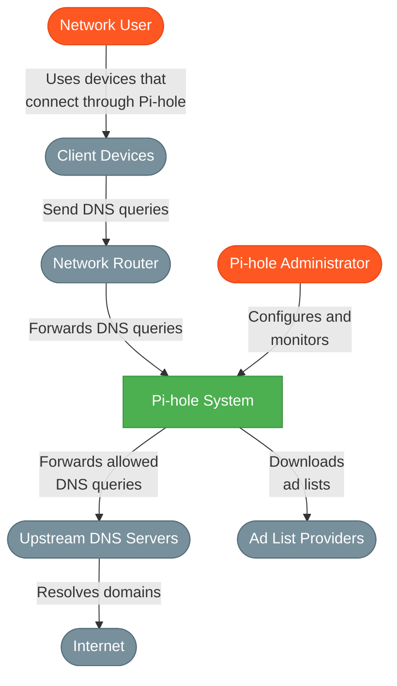
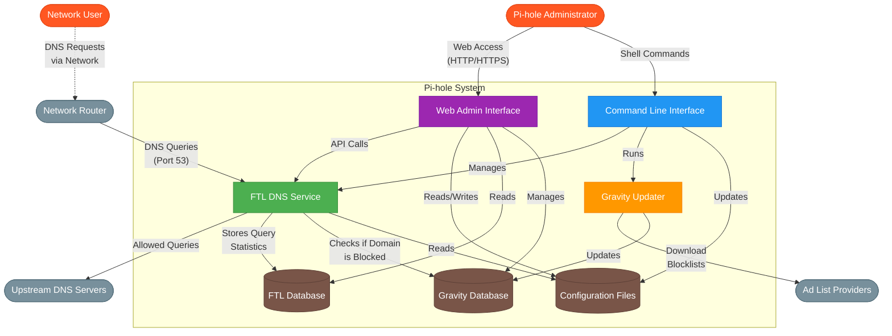
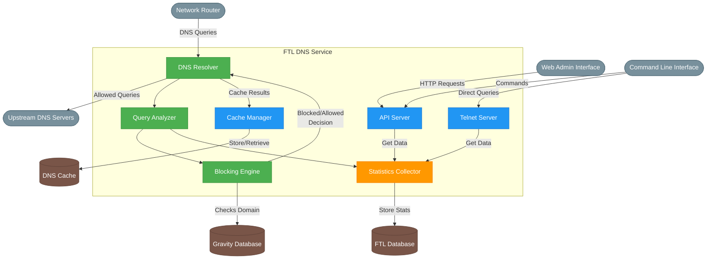
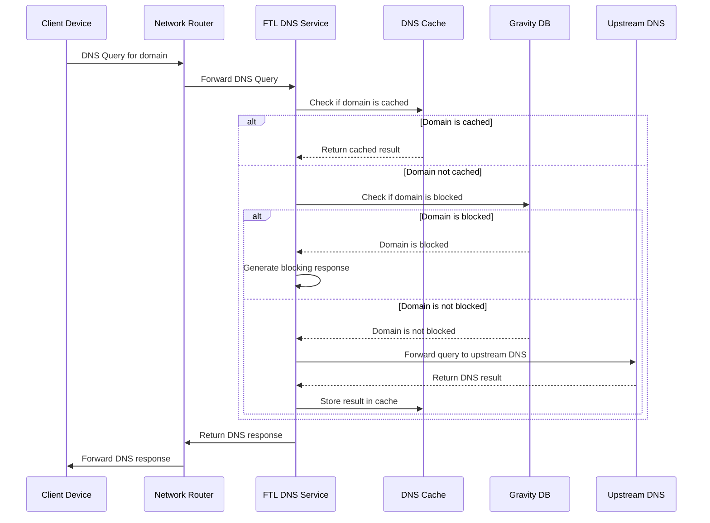
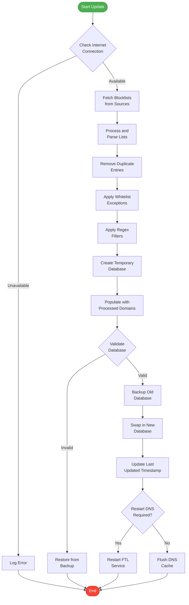

# Pi-hole Architecture Documentation

This document provides a comprehensive overview of the Pi-hole architecture inspired by the C4 model approach, which offers multiple levels of abstraction to understand the system from different perspectives.

## Table of Contents

- [Level 1: System Context](#level-1-system-context)
- [Level 2: Container Diagram](#level-2-container-diagram)
- [Level 3: Component Diagram](#level-3-component-diagram)
- [Additional Diagrams](#additional-diagrams)
    - [DNS Query Flow](#dns-query-flow)
    - [Blocklist Update Process](#blocklist-update-process)

## Level 1: System Context

The System Context diagram shows Pi-hole in its environment, depicting how it interacts with external systems and users.

The System Context diagram shows:

- **Network Users**: People using devices on the network protected by Pi-hole

- **Pi-hole Administrator**: Person who configures and maintains the Pi-hole system

- **Client Devices**: Computers, phones, smart TVs, and other devices on the network

- **Network Router**: Directs network traffic and is configured to use Pi-hole as the DNS server

- **Upstream DNS Servers**: External DNS servers that Pi-hole forwards allowed queries to

- **Ad List Providers**: Sources of domain blocklists that Pi-hole downloads

- **Internet**: The broader internet that devices access through Pi-hole's filtering

## Level 2: Container Diagram

The Container diagram zooms in on the Pi-hole system, showing its major subsystems and how they interact.

The Container diagram shows:

- **FTL DNS Service**: The core DNS service that processes queries and blocks ads

- **Web Admin Interface**: The web-based dashboard for managing Pi-hole

- **Command Line Interface**: The terminal-based interface for administration

- **Gravity Updater**: The component that downloads and processes blocklists

- **Databases**: The Gravity DB (for blocklists) and FTL DB (for statistics)

- **Configuration Files**: Settings that control Pi-hole's behavior

## Level 3: Component Diagram

The Component diagram focuses on the internal structure of the FTL DNS Service, which is the core of Pi-hole's functionality.

The Component diagram shows:

- **DNS Resolver**: Handles incoming DNS queries and returns responses

- **Query Analyzer**: Processes queries to determine if they should be blocked

- **Blocking Engine**: Implements the blocking logic based on blocklists

- **Cache Manager**: Manages the DNS cache for improved performance

- **API Server**: Provides an HTTP API for the Web Admin Interface

- **Telnet Server**: Provides a telnet interface for direct queries

- **Statistics Collector**: Gathers and stores statistics about DNS queries

## Additional Diagrams

### DNS Query Flow

This diagram illustrates the detailed flow of a DNS query through the Pi-hole system.

This sequence diagram shows:

1. A client device sends a DNS query to the router
2. The router forwards the query to Pi-hole's FTL service
3. FTL checks if the domain is in its cache
4. If not cached, FTL checks if the domain is blocked
5. If blocked, FTL generates a blocking response
6. If not blocked, FTL forwards the query to upstream DNS
7. The response is cached and returned to the client

### Blocklist Update Process

This diagram shows how Pi-hole updates its blocklists.

This flowchart shows:

1. The process starts with checking internet connectivity
2. Blocklists are fetched from various sources
3. Lists are processed, deduplicated, and filtered
4. A temporary database is created and populated
5. After validation, the old database is backed up
6. The new database is swapped in
7. The DNS cache is flushed or the FTL service is restarted
