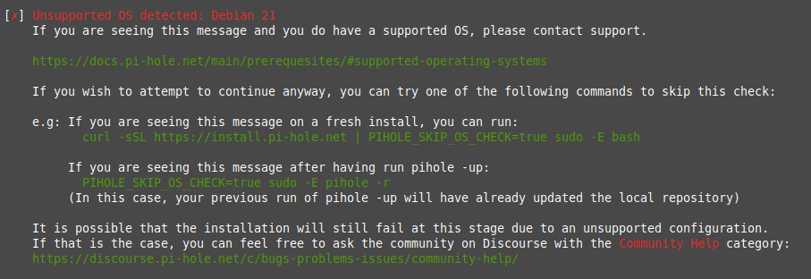

### Hardware

Pi-hole is very lightweight and does not require much processing power

- ~52MB of free space
- 512MB RAM

Despite the name, you are not limited to running Pi-hole on a Raspberry Pi.
Any hardware that runs one of the supported operating systems will do!

### Software

Pi-hole is supported on distributions utilizing [systemd](https://systemd.io/) or [sysvinit](https://www.nongnu.org/sysvinit/)!

#### Supported Operating Systems

The following operating systems are **officially** supported:

| Distribution | Release          | Architecture        |
| ------------ | ---------------- | ------------------- |
| Raspberry Pi OS <br>(formerly Raspbian)     | Stretch / Buster | ARM                 |
| Ubuntu       | 16.x / 18.x / 20.x      | ARM / x86_64        |
| Debian       | 9 / 10           | ARM / x86_64 / i386 |
| Fedora       | 31 / 32          | ARM / x86_64        |
| CentOS       | 7 / 8            | x86_64              |

<!-- markdownlint-disable code-block-style -->
!!! info
    One of the first tasks the install script has is to determine your Operating System's compatibility with Pi-hole

    It is possible that Pi-hole will install and run on variants of the above, but we cannot test them all. If you are using an operating system not on this list you may see the following message:

    

    You can disable this check by setting an environment variable named `PIHOLE_SKIP_OS_CHECK` to `true`, however Pi-hole may have issues installing.
    If you choose to use this environment variable, please use the [Community Help](https://discourse.pi-hole.net/c/bugs-problems-issues/community-help/36) topic on Discourse to troubleshoot any installation issues you may (or may not!) have.


<!-- markdownlint-enable code-block-style -->

### IP Addressing

Pi-hole needs a static IP address to properly function (a DHCP reservation is just fine). Users may run into issues because **we currently install `dhcpcd5`, which may conflict with other running network managers** such as `dhclient`, `dhcpcd`, `networkmanager`, and `systemd-networkd`.

As part of our install process, **we append some lines to `/etc/dhcpcd.conf` in order to statically assign an IP address**, so take note of this before installing.

Please be aware of this fact because it [may cause confusion](https://github.com/pi-hole/pi-hole/issues/1713#issue-260746084). This is not the ideal situation for us to be in but, since a significant portion of our users are running Pi-hole on Raspbian - and because Pi-hole's roots began with the Raspberry Pi - it's a problem that is [difficult to get away from](https://github.com/pi-hole/pi-hole/issues/1713#issuecomment-332317532).

Due to the complexity of different ways of setting an IP address across different systems, it's a slow process and [we need help](https://github.com/pi-hole/pi-hole/issues/629). If you're willing to contribute, please let us know.

### Ports

| Service             | Port         | Protocol | Notes               |
| --------------------|:-------------|:---------| --------------------|
| pihole-FTL             | 53  (DNS)    | TCP/UDP  | If you happen to have another DNS server running, such as BIND, you will need to turn it off in order for Pi-hole to respond to DNS queries. |
| pihole-FTL              | 67  (DHCP)   | IPv4 UDP | The DHCP server is an optional feature that requires additional ports. |
| pihole-FTL              | 547 (DHCPv6) | IPv6 UDP | The DHCP server is an optional feature that requires additional ports. |
| lighttpd            | 80  (HTTP)   | TCP      | If you have another Web server already running, such as Apache, Pi-hole's Web server will not work. You can either disable the other Web server or change the port on which `lighttpd` listens, which allows you keep both Web servers running. |
| pihole-FTL          | 4711    | TCP      | FTL is our API engine and uses port 4711 on the localhost interface. This port should not be accessible from any other interface.|

<!-- markdownlint-disable code-block-style -->
<!-- markdownlint-disable no-trailing-spaces -->
!!! warning "Firewall configuration"
    Do ***never*** open the ports listed above to the Internet. They ***will*** lead to creating an [open resolver](http://openresolverproject.org/). Open resolvers are almost always a severe danger both for you and other users of the Internet. There is a lot that can go wrong and could make you becoming part of a botnet (more precisely a DNS amplification attack participant) very easily. When you need to use your Pi-hole from the Internet (whilst travelling, etc.), you ***must*** set up a VPN to do so (see, e.g., [our OpenVPN guide](../../guides/vpn/overview) on how to do this). This will give you safe and secure access for your Pi-hole from everywhere. This cannot be stressed enough.

!!! info "Random UDP ports"
    Note that Pi-hole uses, by default, *random* UDP ports to send outbound DNS queries from, and listen for their replies on. This makes Pi-hole more secure against DNS spoofing attacks and follows the recommendations from [RFC 5452](https://tools.ietf.org/html/rfc5452#section-4.5) *Measures for Making DNS More Resilient against Forged Answers*, Section 4.5:
    > [...]
    >
    > If multiple ports are used for sending queries, this enlarges the effective ID space by a factor equal to the number of ports used.
    >
    > [...]
    
    By default, FTL chooses a random source port in the range of 1,024 - 65,535 (= 64,512 possibilities) to maxime resilience against forged DNS answers.
<!-- markdownlint-enable code-block-style -->
<!-- markdownlint-enable no-trailing-spaces -->

!!! info "Optional ports"
    The use of lighttpd on port _80_ is optional if you decide not to install the Web dashboard during installation.
    The use of pihole-FTL  on ports _67_ or _547_ is optional, but required if you use the DHCP functions of Pi-hole.

### Firewalls

Below are some examples of firewall rules that will need to be set on your Pi-hole server in order to use the functions available. These are only shown as guides, the actual commands used will be found with your distribution's documentation.
Because Pi-hole was designed to work inside a local network, the following rules will block the traffic from the Internet for security reasons. `192.168.0.0/16` is the most common local network IP range for home users but it can be different in your case, for example other common local network IPs are `10.0.0.0/8` and `172.16.0.0/12`.

**Check your local network settings before applying these rules.**

#### IPTables

IPTables uses two sets of tables. One set is for IPv4 chains, and the second is for IPv6 chains. If only IPv4 blocking is used for the Pi-hole installation, only apply the rules for IP4Tables. Full Stack (IPv4 and IPv6) require both sets of rules to be applied. *Note: These examples insert the rules at the front of the chain. Please see your distribution's documentation for the exact proper command to use.*

IPTables (IPv4)

```bash
iptables -I INPUT 1 -s 192.168.0.0/16 -p tcp -m tcp --dport 80 -j ACCEPT
iptables -I INPUT 1 -s 127.0.0.0/8 -p tcp -m tcp --dport 53 -j ACCEPT
iptables -I INPUT 1 -s 127.0.0.0/8 -p udp -m udp --dport 53 -j ACCEPT
iptables -I INPUT 1 -s 192.168.0.0/16 -p tcp -m tcp --dport 53 -j ACCEPT
iptables -I INPUT 1 -s 192.168.0.0/16 -p udp -m udp --dport 53 -j ACCEPT
iptables -I INPUT 1 -p udp --dport 67:68 --sport 67:68 -j ACCEPT
iptables -I INPUT 1 -p tcp -m tcp --dport 4711:4720 -i lo -j ACCEPT
iptables -I INPUT -m conntrack --ctstate RELATED,ESTABLISHED -j ACCEPT
```

IP6Tables (IPv6)

```bash
ip6tables -I INPUT -p udp -m udp --sport 546:547 --dport 546:547 -j ACCEPT
ip6tables -I INPUT -m conntrack --ctstate RELATED,ESTABLISHED -j ACCEPT
```

#### FirewallD

Using the `--permanent` argument will ensure the firewall rules persist reboots. If only IPv4 blocking is used for the Pi-hole installation, the `dhcpv6` service can be removed from the commands below. Create a new zone for the local interface (`lo`) for the pihole-FTL ports to ensure the API is only accessible locally. Finally `--reload` to have the new firewall configuration take effect immediately.

```bash
firewall-cmd --permanent --add-service=http --add-service=dns --add-service=dhcp --add-service=dhcpv6
firewall-cmd --permanent --new-zone=ftl
firewall-cmd --permanent --zone=ftl --add-interface=lo
firewall-cmd --permanent --zone=ftl --add-port=4711/tcp
firewall-cmd --reload
```

#### ufw

ufw stores all rules persistent, so you just need to execute the commands below.

IPv4:

```bash
ufw allow 80/tcp
ufw allow 53/tcp
ufw allow 53/udp
ufw allow 67/tcp
ufw allow 67/udp
```

IPv6 (include above IPv4 rules):

```bash
ufw allow 546:547/udp
```

{!abbreviations.md!}
