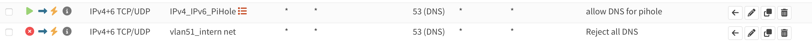

This guide was developed using a OPNsense 25.1.1. Following the first method below will have you adding your Pi-hole as a DNS server for all devices on your LAN. Following the second method below will have DNS queries route through your OPNsense and then to your Pi-hole. Either option is valid, depending on your specific requirements, but it is recommended to choose one or the other - not both.

There is also the different firewall rule options to prevent clients like Chromecasts of using their hardcoded 8.8.8.8 DNS servers and use your pihole Pi-hole instead.
Beware: This tutorial does not explain on how to block DoH or DoT.

### Grab your IPv4 and IPv6 address from your Pi-hole

SSH into your Pi-hole. A quick `ifconfig eth0` (substituting `eth0` for the applicable network interface) will get you the address information:

```
eth0: flags=4163<UP,BROADCAST,RUNNING,MULTICAST>  mtu 1500
        inet 10.0.51.2  netmask 255.255.255.0  broadcast 192.168.0.255
        inet6 2001:470:5:3::8ed  prefixlen 128  scopeid 0x0<global>
        inet6 2001:470:5:3:8d70:e92e:7030:6eef  prefixlen 64  scopeid 0x0<global>
        inet6 fe80::337f:710d:6781:4c85  prefixlen 64  scopeid 0x20<link>
        ether dc:a6:32:0e:31:2d  txqueuelen 1000  (Ethernet)
        RX packets 1297459  bytes 1279521260 (1.1 GiB)
        RX errors 0  dropped 0  overruns 0  frame 0
        TX packets 2315988  bytes 2766370095 (2.5 GiB)
        TX errors 0  dropped 0 overruns 0  carrier 0  collisions 0
```

Take note of the `inet` address, and the `inet6` address which starts with `fe` (denotes a local link or LAN address). Those are the IPs which you'll use as your DNS servers. For this example, we'll be using the `10.0.51.2` and `fe80::337f:710d:6781:4c85` IPs for the following directions.

### Method 1: Distribute Pi-hole as DNS server via DHCP

Choosing this option will have DNS queries taking the following path:

```
(Clients) -> Pi-hole -> Upstream DNS Server (or Unbound reverse DNS)
```

#### IPv4

Go to **Services** --> **ISC DHCPv4** and click on the interface that you want to modify.
Under **DNS servers** enter your Pi-hole IPv4 address into the first line.
Leave the second line blank unless you have another Pi-hole host running.


#### IPv6


Go to **Interfaces** and click on the interface that you want to modify.
Under **Manual configuration** check "Allow manual adjustment of DHCPv6 and Router Advertisements"


Now go to **Services** --> **Router Advertisement** and click on the interface that you want to modify.
Under **DNS servers** enter your Pi-Holes IPv6 address into the first line.
Leave the second line blank unless you have another Pi-hole host running.


Beware: Link local IPv6 are not reachable from other VLANs.


All client devices on your network should now automatically be configured with a single IPv4 and single IPv6 address for DNS resolution. If you don't see your client devices update quickly enough, you *can* toggle Wi-Fi off/on or disconnect the Ethernet cable for a couple of seconds and then reconnect it.

### Method 2: Using your Pi-hole as DNS server for your OPNsense

If you'd rather have your OPNsense forward all DNS traffic to Pi-hole, you can complete this *alternative* step.
Doing so will have DNS queries taking the following path:

```
(Clients) -> OPNsense -> Pi-hole -> Upstream DNS Server
```

!!! warning
    Keep in mind that if you are using your OPNsense IP address as an upstream resolver for your Pi-hole together with this configuration, ***this will cause a resolver loop***. Make sure to have another upstream DNS server(s) set in your Pi-hole's configuration, or use Pi-hole as [your own recursive DNS server with Unbound](https://docs.pi-hole.net/guides/dns/unbound/?h=unbound#configure-unbound).

1. In Pi-hole, navigate to `Settings -> DNS` and ensure you have at least one external upstream DNS server enabled.
2. In OPNsense navigate to `Settings -> General -> Networking`.
3. Under DNS Servers, enter the IPv4 and or IPv6 address of your Pi-hole host, and set the gateway to your WAN interface.
4. Uncheck `Allow DNS server list to the overridden by DHCP/PPP on WAN`.
5. Click Save.

### Block other DNS servers (optional)

Some clients have hardcoded DNS settings. To prevent them from circumventing our Pi-Hole, we can optionally block all DNS request that are not coming from our Pi-Hole.
!!! warning
   If your device does not have any fallback from the hardcoded DNS settings, this could break its DNS.

We first create an Alias for Pi-holes IPs.
Go to **Firewall** --> **Aliases** scroll down and click on the plus button to create a new alias.
Give it a Name and add the IPv4 and IPv6 into the "Content" field and then click save.


Now go to **Firewall** --> **Rules** and click on the interface that you want to modify.

We create one rule to allow Pi-hole to do DNS over IPv4 + IPv6.
After that rule, we create a rule to reject ALL DNS. It is important that this reject rule is after the other rule.
OPNsense does the first rule that matches, if we have our reject rule first, Pi-hole can not reach any DNS servers.
It should look something like this:



We don't need a rule to allow for example device 10.0.51.10 to reach our Pi-hole at 10.0.51.2, since they are both on the same network, DNS request will not be routed through OPNsense. Instead the client 10.0.51.10 will directly contact Pi-hole for DNS requests.
