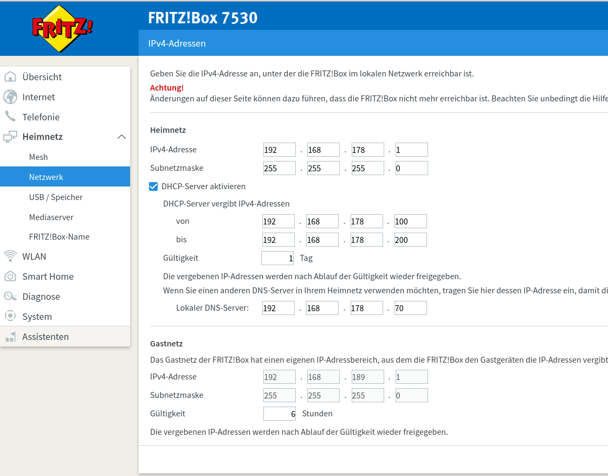
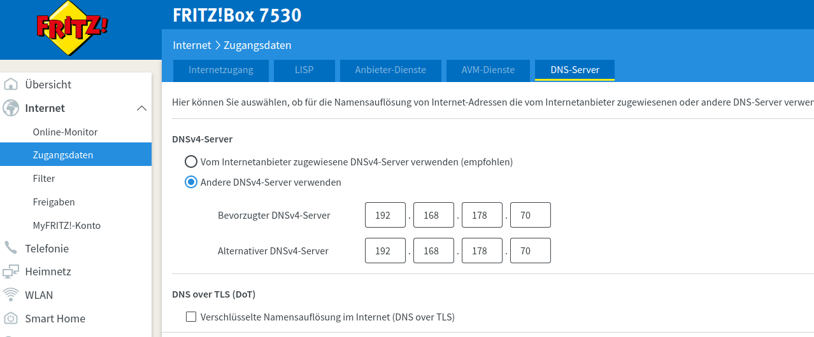
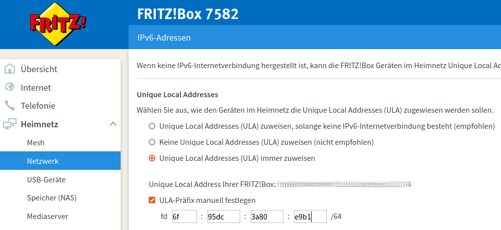
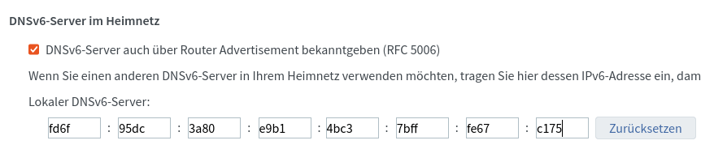

Diese Anleitung soll die grundlegenden Prinzipien für ein reibungsloses Zusammenspiel zwischen Fritz!Box und Pi-hole verdeutlichen. Sie wurde für FRITZ!OS 07.21 geschrieben, sollte jedoch auch mit anderen Firmware-Versionen funktionieren.

!!! note "Hinweis"
    Es gibt nicht nur **die eine Art**, ein funktionierendes DNS-System aufzusetzen.  Konfiguriert euer Netzwerk nach euren Bedürfnissen.

### Erweiterte Ansicht aktivieren

Einige dieser Einstellungen sind nur sichtbar, wenn vorher die Ansicht auf "Erweitert" gesetzt wurde. Diese wird durch Umschalten (Klick) auf "Standard" am unteren linken Bildrand aktiviert.


## Pi-hole als DNS Server via DHCP an Clients verteilen (LAN Seite)

Mit dieser Konfiguration wird allen Clients die IP des Pi-hole als DNS Server angeboten, wenn sie einen DHCP Lease von der Fritz!Box anfordern.
DNS Anfragen nehmen folgenden Weg

``` plain
Client -> Pi-hole -> Upstream DNS Server
```

!!! note "Hinweis"
    Die Fritz!Box selbst wird den unter Internet/Zugangsdaten/DNS-Server eingestellten DNS Server nutzen (siehe unten).
    Die Fritz!Box kann der Upstream Server von Pi-hole sein, solange Pi-hole nicht der Upstream Server der Fritz!Box ist. Dies würde zu einem DNS Loop führen.

Um diese Konfiguration zu nutzen, muss die IP des Pi-hole als "Lokaler DNS-Server" in

``` plain
Heimnetz/Netzwerk/Netzwerkeinstellungen/IP-Adressen/IPv4-Konfiguration/Heimnetz
```

eingetragen werden.



!!! warning "Warnung"
    Clients bemerken Änderungen an den DHCP Einstellungen erst, wenn der DHCP Lease erneuert wird. Der einfachste Weg dies zu erzwingen ist ein Unterbrechen und Wiederherstellen der Netzwerkverbindung.

Nun sollten einzelne Clients im Pi-hole Dashboard auftauchen.

## Pi-hole als Upstream DNS Server der Fritz!Box (WAN  Seite)

Mit dieser Konfiguration wird Pi-hole  auch von der Fritz!Box selbst als Upstream DNS Server genutzt. DNS Anfragen nehmen folgenden Weg

``` plain
(Clients) -> Fritz!Box -> Pi-hole -> Upstream DNS Server
```

Zum Einstellen muss die IP des Pi-hole als "Bevorzugter DNSv4-Server" **und** "Alternativer DNSv4-Server" in

``` plain
Internet/Zugangsdaten/DNS-Server
```

eingetragen werden.



!!! warning "Warnung"
    Die Fritz!Box darf mit dieser Konfiguration nicht als Upstream DNS Server im Pi-hole eingestellt werden. Dies würde zu einem DNS Loop führen, da Pi-hole dann die Anfragen an die Fritz!Box senden würde, welche sie wiederum an Pi-hole senden würde.

Wird ausschließlich diese Konfiguration genutzt, sind im Pi-hole Dashboard keine individuellen Clients sichtbar. Für Pi-hole scheinen alle Anfragen von der Fritz!Box zu kommen. Dadurch können nicht alle Funktionen von Pi-hole genutzt werden, z.B. die Möglichkeit, Clients individuell zu filtern (Group Management). Wenn dies gewünscht ist, muss Pi-hole (zusätzlich) als DNS Server via DHCP an die Clients verteilt werden (siehe oben).

### Pi-hole im Gastnetzwerk nutzen

Es gibt in der Fritz!Box keine Möglichkeit unter

``` plain
Heimnetz/Netzwerk/Netzwerkeinstellungen/IP-Adressen/IPv4-Konfiguration/Gastnetz
```

den DNS Server des Gastnetzwerks einzustellen.

Die Fritz!Box wird immer ihre eigene IP als DNS Server des Gastnetzes einstellen. Um die DNS Anfragen dennoch über den Pi-hole zu senden, muss dieser als Upstream DNS Server für die Fritz!Box eingetragen werden. Da es keine andere Option gibt, werden alle Anfragen aus dem Gastnetz für Pi-hole so erscheinen, als ob sie direkt von der Fritz!Box kommen. Eine individuelle Filterung je nach Client innerhalb des Gastnetzwerks ist deshalb nicht möglich.

## Hostnamen in Pi-hole statt IP-Addressen - Conditional forwarding

Wenn die Fritz!Box im Netzwerk als DHCP Server fungiert, werden die Hostnamen der Clients nur dort registriert. Pi-hole versucht standardmäßig, die IP-Adressen der Clients wieder in Hostnamen aufzulösen. Daher müssen die Anfragen zur Fritz!Box gelangen.
Dafür gibt es zwei Wege:

* Die Fritz!Box ist der Upstream DNS Server des Pi-holes. Damit landen alle Anfragen sowieso bei der Fritz!Box, welche die Hostnamen an Pi-hole zurücksenden kann.

!!! warning "Warnung"
    Die Fritz!Box darf nur der Upstream DNS Server des Pi-hole sein, wenn dieser nicht gleichzeitig der Upstream DNS Server der Fritz!Box ist. Dies würde zu einem DNS Loop führen.

* Es werden nur die Anfragen an die Fritz!Box gesendet, welche versuchen im lokalen Netzwerk IP-Adressen wieder Hostnamen zuzuordnen. Alle anderen Anfragen werden an den Upstream DNS Server des Pi-Hole gesendet. Dafür ist die Option *Conditional forwarding* zuständig.
Folgende Einstellungen müssen dafür vorgenommen werden:
    * **Local network in CIDR notation:** IP-Bereich des Netzwerks in CIDR Notation, Standard für die Fritz!Box ist **192.168.178.0/24**
    * **IP address of your DHCP server (router):** IP-Adresse der Fritz!Box selbst, Standard ist **192.168.178.1**
    * **Local domain name (optional):** Name der lokalen Domän, für die Fritz!Box **fritz.box**


## Pi-hole als DNS Server via IPv6

Mit dieser Konfiguration bekommen alle Clients die IPv6 von Pi-hole als DNS-Server über DHCPv6 und Router Advertisement (RA/RDNSS, SLAAC) angeboten, wenn sie mit Ihrer Fritz!Box verbunden sind.

### ULA Adressraum aktivieren

Unique Local Addresses (ULAs) sind lokale IPv6-Adressen, die nicht über das Internet geroutet werden. Sie sind vergleichbar mit den privaten IPv4-Netzbereichen (`192.168.x.y`).

Zum aktivieren, wähle "Unique Local Addresses (ULA) immer zuweisen" aus in

``` plain
Heimnetz/Netzwerk/Netzwerkeinstellungen/IP-Adressen/IPv6-Konfiguration/Unique Local Addresses
```

!!! note "Hinweis"
    Es wird empfohlen, das ULA-Präfix zu ändern, um Kollisionen mit anderen Netzen zu vermeiden.
    Die ersten 40 Bits sollten gemäß RFC4193 oder durch einen einfachen Online-Generator, wie [unique-local-ipv6.com](https://www.unique-local-ipv6.com/), erzeugt werden. Die restlichen 16 Bits sind die Subnetz-ID und können frei gewählt werden.
    Nach dem Auswählen von "ULA-Präfix manuell festlegen" kann man sein eigenes Präfix einstellen.



Damit das Pi-hole eine ULA-Adresse erhält, muss der Pi-hole Server kurz vom Netzwerk getrennt werden oder neu gestartet werden. Die erhaltene Adresse kann man dann auf dem Pi-hole mit dem Befehl

``` bash
ip address | grep "inet6 fd"
```

erhalten. Diese Adresse wird im folgenden Abschnitt verwendet.

### Pi-hole als DNS Server verteilen

Nun kann die IPv6 Adresse des Pi-hole als "Lokaler DNSv6-Server" in

``` plain
Heimnetz/Netzwerk/Netzwerkeinstellungen/IP-Adressen/IPv6-Konfiguration/DNSv6-Server im Heimnetz
```

eingetragen werden.

!!! note "Hinweis"
    Es ist empfehlenswert "DNSv6-Server auch über Router Advertisement bekanntgeben (RFC 5006)" auszuwählen.



## Optional: Erhöhung der Priorität von DNS Anfragen {#optional-erhohung-der-prioritat-von-dns-anfragen}

Bei ausgelasteter Internetverbindung werden DNS-Anfragen u.U. stark verzögert bearbeitet. Dies kann in der Fritz!Box durch Hinterlegen von DNS als priorisierter Echtzeitanwendung vermieden werden. Falls nicht bereits geschehen, fügen Sie hierfür zunächst "`DNS`" als neuen Answendungstyp unter

``` plain
Internet/Filter/Listen -> Netzwerkanwendungen -> Netzwerkanwendung hinzufügen
```

mit den Eigenschaften

``` plain
Netzwerkanwendung: DNS
Protokoll: UDP
Quellport: beliebig
Zielport: 53
```

sowie

``` plain
Netzwerkanwendung: DNS
Protokoll: TCP
Quellport: beliebig
Zielport: 53
```

hinzu.

Dieser Eintrag kann dann unter

``` plain
Internet/Filter/Priorisierung -> Echtzeitanwendungen -> Neue Regel
```

hinzugefügt werden. Wählen Sie nun ihr Pi-hole aus. Sollten Sie sich unsicher sein, kann hier auch "`Alle Geräte`" ausgewählt werden. Unter "`Netzwerkanwendung`" wählen Sie den soeben angelegten Eintrag "`DNS`" aus.

## Optional: DNS Anfragen nur vom Pi-hole erlauben

Nach der Konfiguration des Pi-holes als DNS Server des Netzwerks ist die Einrichtung abgeschlossen. Es bleibt jedoch weiterhin das Risiko einer Umgehung des Pi-holes bestehen - Netzwerkgeräte können sich direkt mit anderen, frei verfügbaren, DNS Servers im Internet verbinden. Dies kann durch eine geeignete Fiterregel jedoch einfach verhindert werden.

!!! warning "Warnung"
    Einige Geräte oder Programme nutzen fest hinterlegte DNS Server und funktionieren ggfs. nicht mehr ordnungsgemäß falls sie diesen DNS Server nicht erreichen können. Fall solch ein Verhalten auftritt, können Sie dieses Gerät von der Filterregel ausnehmen.
Insofern nicht bereits vorhanden, legen Sie unter

``` plain
Internet/Filter/Zugangsprofile -> Zugangsprofile verwalten und optimal nutzen
```

zwei Zugangsprofile an (z.B. "`Standard`" und "`Unbeschränkt`"). Im Profil "`Standard`" fügen Sie unter

``` plain
Erweiterte Einstellungen -> Gesperrte Netzwerkanwendungen
```

die [angelegte Netzwerkanwendung "`DNS`"](#optional-erhohung-der-prioritat-von-dns-anfragen) hinzu.
Im Profil "`Unbeschränkt`" darf "`DNS`" *nicht* als gesperrt hinterlegt werden.

Nun werden die Zugangsprofile unter

``` plain
Internet/Filter/Kindersicherung -> Zugangsprofile ändern (am Ende der Seite)
```

so konfiguriert, dass *sämtliche* Geräte *außer* dem Pi-hole (inkl. "`Alle anderen Geräte`") dem Zugangsprofil "`Standard`" (DNS wird blockiert) zugewiesen werden. Das Pi-hole selbst wird dem Zugangsprofil ("`Unbeschränkt`") zugeordnet um weiterhin DNS Anfragen absetzen zu können. Die Regel wird unmittelbar nach dem Speichern aktiv.

Die neue Filterregel kann z.B. durch den Aufruf von

``` bash
dig google.com @8.8.8.8 +short
```

auf dem Pi-Hole und auf einem beliebigen anderen Gerät im Netzwerk getestet werden. Während die Abfrage auf dem Pi-hole wie erwartet eine IP-Adresse zurückgeben sollte, sollte auf allen anderen Geräten eine Fehlermeldung wie

``` plain
;; communications error to 8.8.8.8#53: host unreachable
```

angezeigt werden. Dies belegt, dass DNS-Bypassing nun von der Fritz!Box blockiert wird.
