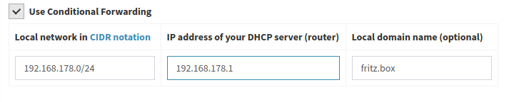

Diese Anleitung wurde für FRITZ!OS 07.21 geschrieben, sollte jedoch auch mit anderen Firmware-Versionen funktionieren. Ziel ist es, grundlegende Prinzipien für ein reibungsloses Zusammenspiel zwischen Fritz!Box und Pi-hole zu verdeutlichen.

> Hinweis:
Es gibt nicht nur **die eine Art**, eine funktionierende DNS System aufzusetzen.  Konfiguriert euer Netzwerk nach euren Bedürfnissen.
Diese Anleitung wurde für IPv4 geschrieben und muss für IPv6 Netwerke entsprechend angepasst werden.

### Erweiterte Ansicht aktivieren

Einige dieser Einstellungen sind nur sichtbar, wenn voher die Ansicht auf "Erweitert" gesetzt wurde. Diese wird durch Umschalten (Klick) auf "Standard" am unteren linken Bildrand aktiviert.


## Pi-hole als DNS Server via DHCP an Clients verteilen (LAN Seite)

Mit dieser Konfiguration wird allen Clients die IP des Pi-hole als DNS Server angeboten, wenn sie einen DHCP Lease von der Fritz!Box anfordern.
DNS Anfragen nehmen folgenden Weg

```bash
Client -> Pi-hole -> Upstream DNS Server
```

> Hinweis:
Die Fritz!Box selbst wird den unter Internet/Zugangsdaten/DNS-Server eingestellten DNS Server nutzen (siehe unten).
Die Fritz!Box kann der Upstream Server von Pi-hole sein, solange Pi-hole nicht der Upstream Server der Fritz!Box ist. Dies würde zu einem DNS Loop führen.

Um diese Konfiguration zu nutzen, muss die IP des Pi-hole als "Lokaler DNS-Server" in

```bash
Heimnetz/Netzwerk/Netzwerkeinstellungen/IP-Adressen/IPv4-Konfiguration/Heimnetz
```

eingetragen werden.


>Hinweis:
Clients bemerken Änderungen an den DHCP Einstellungen erst, wenn der DHCP Lease erneuert wird. Der einfachste Weg dies zu erzwingen ist ein Unterbrechen und Wiederherstellen der Netzwerkverbindung.

Nun sollten einzelne Clients in Pi-hole Dashboard auftrauchen.

## Pi-hole als Upstream DNS Server der Fritz!Box (WAN  Seite)

Mit dieser Konfiguration wird Pi-hole  auch von der Fritz!Box selbst als Upstream DNS Server genutzt. DNS Anfragen nehmen folgenden Weg

```bash
(Clients) -> Fritz!Box -> Pi-hole -> Upstream DNS Server
```

Zum Einstellen muss die IP des Pi-hole als "Bevorzugter DNS-Server" **und** "Alternativer DNS-Server" in

```bash
Internet/Zugangsdaten/DNS-Server
```

eingetragen werden.


!!! warning
    Die Fritz!Box darf mit dieser Konfiguration nicht als Upstream DNS Server im Pi-hole eingestellt werden. Dies würde zu einem DNS Loop führen, da Pi-hole dann die Anfragen an die Fritz!Box senden würde, welche sie wiederum an Pi-hole senden würde.

Wird ausschließlich diese Konfiguration genutz, sind im Pi-hole Dashboard keine individuellen Clients sichtbar. Für Pi-hole scheinen alle Anfragen von der Fritz!Box zu kommen. Dadurch können nicht alle Funktionen von Pi-hole genutzt werden, z.B. die Möglichkeit, Clients individuell zu filtern (Group Management). Wenn dies gewünscht ist, muss Pi-hole (zusätzlich) als DNS Server via DHCP an die Clients verteilt werden (siehe oben).

### Pi-hole im Gastnetzwerk nutzen

Es gibt in der Fritz!Box keine Möglichkeit unter

```bash
Heimnetz/Netzwerk/Netzwerkeinstellungen/IP-Adressen/IPv4-Konfiguration/Gastnetz
```

den DNS Server des Gastnetzwerks einzustellen.

Die Fritz!Box wird immer ihre eigene IP als DNS Server des Gastnetzes einstellen. Um die DNS Anfragen dennoch über den Pi-hole zu senden, muss dieser als Upstream DNS Server für die Fritz!Box eingetragen werden. Da es keine andere Option gibt, werden alle Anfragen aus dem Gastnetz für Pi-hole so erscheinen, als ob sie direkt von der Fritz!Box kommen. Eine individuelle Filterung je nach Client innerhalb des Gastnetzwerks ist deshalb nicht möglich.

## Hostnamen in Pi-hole statt IP-Addressen - Conditional forwarding

Wenn die Fritz!Box im Netzwerk als DHCP Server fungiert, werden die Hostnamen der Clients nur dort registriert. Pi-hole versucht standardmäßig, die IP-Adressen der Clients wieder in Hostnamen aufzulösen. Daher müssen die Anfragen zur Fritz!Box gelangen.
Dafür gibt es zwei Wege:

* Die Fritz!Box ist der Upstream DNS Server des Pi-holes. Damit landen alle Anfragen sowieso bei der Fritz!Box, welche die Hostnamen an Pi-hole zurücksenden kann.

!!! warning
    Die Fritz!Box darf nur der Upstream DNS Server des Pi-hole sein, wenn dieser nicht gleichzeitig der Upstream DNS Server der Fritz!Box ist. Dies würde zu einem DNS Loop führen.

* Es werden nur die Anfragen an die Fritz!Box gesendet, welche versuchen im lokalen Netzwerk IP-Adressen wieder Hostnamen zuzuordnene. Alle anderen Anfragen werden an den Upstream DNS Server des Pi-Hole gesendet. Dafür ist die Option *Conditional forwarding* zuständig.
Folgende Einstellungen müssen dafür vorgenommen werden:
    * **Local network in CIDR notation:** IP-Bereich des Netzwerks in CIDR Notation, Standard für die Fritz!Box ist **192.168.178.0/24**
    * **IP address of your DHCP server (router):** IP-Adresse der Fritz!Box selbst, Standard ist **192.168.178.1**
    * **Local domain name (optional):** Name der lokalen Domän, für die Fritz!Box **fritz.box**


