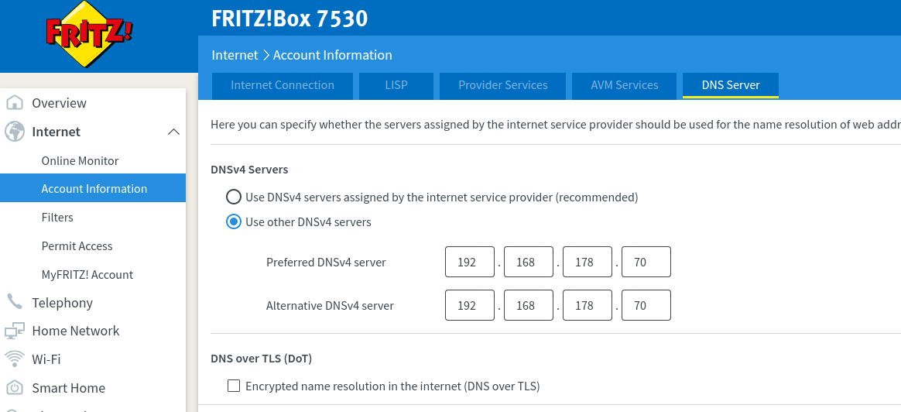
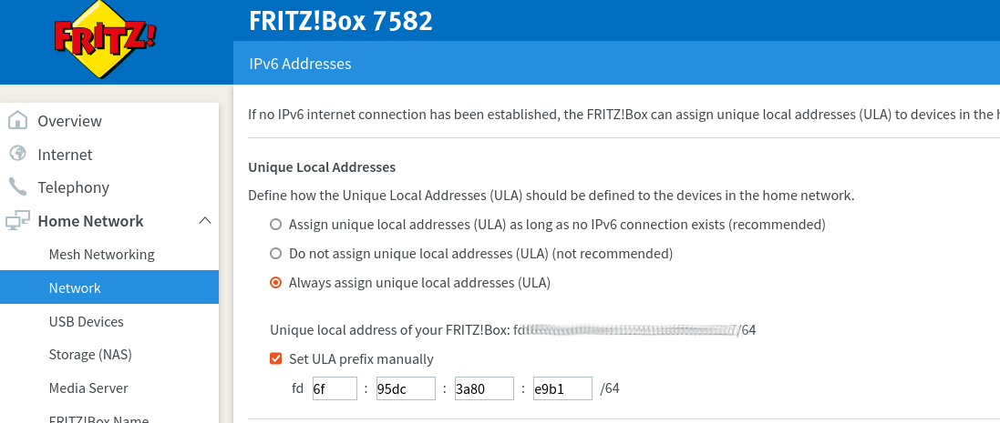
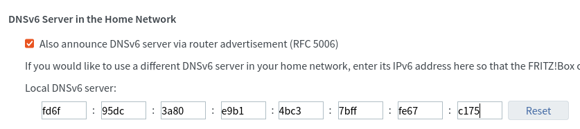

This guide was developed using FRITZ!OS 07.21 but should work for others too. It aims to line out a few basic principles to have a seamless DNS experience with Pi-hole and Fritz!Boxes.

!!! note
    There is no single way to do it right. Choose the one best fitting your needs.

### Enable advanced settings

Some of the following settings might be visible only if advanced settings are enabled. Therefore, "View" has to be changed to advanced by clicking on "Standard" in the lower left corner.


## Distribute Pi-hole as DNS server via DHCP

Using this configuration, all clients will get Pi-hole's IP offered as DNS server when they request a DHCP lease from your Fritz!Box.
DNS queries take the following path

``` plain
Client -> Pi-hole -> Upstream DNS Server
```

!!! note
    The Fritz!Box itself will use whatever is configured in Internet/Account Information/DNS server (see below).
    The Fritz!Box can be Pi-hole's upstream DNS server, as long Pi-hole itself is not the upstream server of the Fritz!Box. This would cause a DNS loop.

To set it up, enter Pi-hole's IP as "Local DNS server" in

``` plain
Home Network/Network/Network Settings/IP Addresses/IPv4 Configuration/Home Network
```


!!! warning
    Clients will notice changes in DHCP settings only after they acquired a new DHCP lease. The easiest way to force a renewal is to dis/reconnect the client from the network.

Now you should see individual clients in Pi-hole's web dashboard.


## Pi-hole as upstream DNS server for your Fritz!Box

With this configuration, Pi-hole is also used by the Fritz!Box itself as an upstream DNS server. DNS queries take the following path

``` plain
(Clients) -> Fritz!Box -> Pi-hole -> Upstream DNS Server
```

To set it up, enter Pi-hole's IP as "Preferred DNSv4 server" **and** "Alternative DNSv4 server" in

``` plain
Internet/Account Information/DNS server
```



!!! warning
    Don't set the Fritz!Box as upstream DNS server for Pi-hole if using this configuration! This will lead to a DNS loop as the Pi-hole will send the queries to the Fritz!Box which in turn will send them to Pi-hole.

If only this configuration is used, you won't see individual clients in Pi-hole's dashboard. For Pi-hole, all queries will appear as if they are coming from your Fritz!Box. You will therefore miss out on some features, e.g. Group Management. If you want to use them, Pi-hole must (additionally) be distributed to the clients as DNS server via DHCP (see above).

### Using Pi-hole within the Guest Network

There is no option to set the DNS server for the guest network in

``` plain
Home Network/Network/Network Settings/IP Addresses/IPv4 Configuration/Guest Network
```

The Fritz!Box always sets its own IP as DNS server for the guest network. To filter its traffic, you have to setup Pi-hole as upstream DNS server for your Fritz!Box. As there is no other option, all DNS requests from your guest network will appear as coming from your Fritz!Box. Individual filtering per client within the guest network is therefore not possible.

## Hostnames instead of IP addresses in Pi-hole's web interface - Conditional forwarding

In case the Fritz!Box is used as DHCP server, client's hostnames are registered only there.  By default, Pi-hole tries to resolve the IP addresses of the clients back into host names. Therefore, the requests must reach the Fritz!Box.
There are two ways to do this:

* The Fritz!Box is the upstream DNS server of the Pi-hole. This means that all queries end up with the Fritz!Box anyway, which can send the host names back to Pi-hole.

!!! warning
    The Fritz!Box may only be the upstream DNS server of the Pi-hole if Pi-hole is not the upstream DNS server of the Fritz!Box. This would lead to a DNS loop.

* Only those queries are sent to the Fritz!Box that attempt to determine hostnames for IP addresses (clients) of the local network. All other requests are sent to the upstream DNS server of the Pi-Hole. The *Conditional forwarding* option is responsible for this.
The following settings must be made:
    * **Local network in CIDR notation:** Standard IP range of the  Fritz!Box is **192.168.178.0/24**
    * **IP address of your DHCP server (router):** IP of the Fritz!Box, standard is **192.168.178.1**
    * **Local domain name (optional):** Fritz!Box uses **fritz.box**


## Distribute Pi-hole as DNS server via IPv6

Using this configuration, your Fritz!Box will offer Pi-hole's IPv6 as local DNS server to its clients via DHCPv6 as well as Router Advertisement (RA/RDNSS, SLAAC).

### Enable ULA addresses

Unique local addresses (ULA) are local IPv6 addresses which are not routed on the internet. They are comparable to the IPv4 private network ranges (such as `192.168.x.y`).

To enable ULA addresses, select "Always assign unique local addresses (ULA)" in

``` plain
Home Network/Network/Network Settings/IP Addresses/IPv6 Addresses/Unique Local Addresses
```

!!! note
    It is recommended to change the ULA prefix in order to prevent collisions with other networks.
    You should generate the first 40 bits according to RFC4193 or use a simple online generator, like [unique-local-ipv6.com](https://www.unique-local-ipv6.com/). The remaining 16 bits are the subnet id and are free to choose.
    Select "Set ULA prefix manually" and enter a custom prefix.



To obtain the new address, reconnect or reboot your Pi-hole server. The obtained ULA address of your Pi-hole can be seen when running the command

``` bash
ip address | grep "inet6 fd"
```

on your Pi-hole. This address will be used in the following section.

### Distribute Pi-hole as DNS server

It is now possible to enter Pi-hole's stable IPv6 address as "Local DNSv6 server" in

``` plain
Home Network/Network/Network Settings/IP Addresses/IPv6 Addresses/DNSv6 Server in the Home Network
```

!!! note
    It is recommended to select "Also announce DNSv6 server via router advertisement (RFC 5006)".



## Optional: Increasing the priority of DNS requests

When the Internet connection is busy, DNS queries may only be processed with a long delay. This can be avoided in the Fritz!Box by adding DNS as a prioritized real-time application. If you have not already done so, first add "`DNS`" as a new application type under

``` plain
Internet/Filter/Lists -> Network Applications -> Add Network Application
```

with the properties

``` plain
Network application: DNS
Protocol: UDP
Source port: any
Destination port: 53
```

and

``` plain
Network application: DNS
Protocol: TCP
Source port: any
Destination port: 53
```


This entry can then be added under

``` plain
Internet/Filter/Prioritization -> Real-time applications -> New rule
```

Select your Pi-hole as the device to which the rule should apply. If you are unsure, "`All devices`" may also be useful selection here. As "`Network Application`" select the "`DNS`" entry you just created.

## Optional: Allow DNS queries only from the Pi-hole

After configuring the Pi-hole as the network's DNS server, the setup is complete. However, there is still a risk of clients trying to bypass your Pi-hole as network devices can connect directly to other, freely available, DNS servers on the Internet. However, this can be easily prevented by a suitable filter rule.

!!! warning
    Some devices or applications use hard-coded DNS servers and may not work as expected if they can't  reach the desired DNS server. If you observe such behavior, you can easily remove the affected device from this filter.

If not already present, create two access profiles (e.g. "`Standard`" and "`Unrestricted`") under

``` plain
Internet/Filters/Access Profiles -> Manage and Optimize Access Profiles
```

In the profile "`Standard`" add the network application "`DNS`" ([created above](#optional-increasing-the-priority-of-dns-requests)) under:

``` plain
Advanced settings -> Locked network applications
```

In the profile "`Unrestricted`" "`DNS`" must *not* be set as blocked.

Now the access profiles under

``` plain
Internet/Filters/Parental Control -> Change Access Profiles (at the bottom of the page)
```

are configured such that *all* devices *except* the Pi-hole (including "`All other devices`") are assigned to the access profile "`Standard`" (DNS is blocked). The Pi-hole itself is assigned to the access profile "Unrestricted" to be able to send DNS queries. The rule becomes active immediately after saving.

You can easily test whether this is working by trying

``` bash
dig google.com @8.8.8.8 +short
```

once on your Pi-hole and once on any other device in your network. While the query on your Pi-hole should return an IP address as expected, you should see an error such as

``` plain
;; communications error to 8.8.8.8#53: host unreachable
```

on any other device verifying that DNS-bypassing is now blocked by our Fritz!Box.
