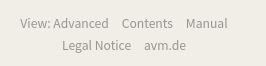
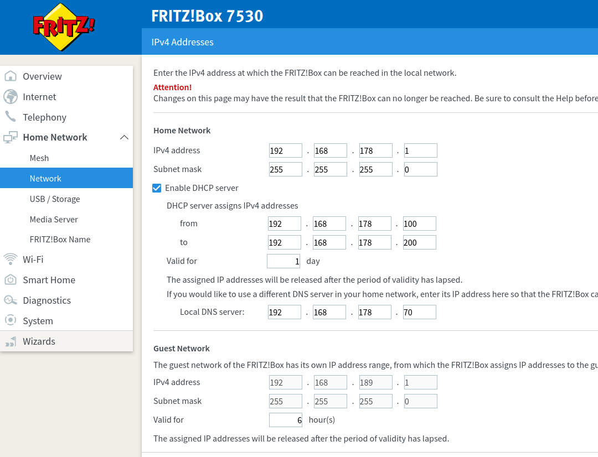
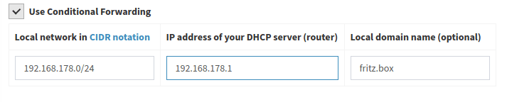

This guide was developed using FRITZ!OS 07.21 but should work for others too. It aims to line out a few basic principles to have a seamless DNS experience with Pi-hole and Fritz!Boxes.

> Note:
There is no single way to do it right. Choose the one best fitting your needs.
This guide is IPv4 only. You need to adjust for IPv6 accordingly.

### Enable advanced settings

Some of the the following settings might be visible only if advanced settings are enabled. Therefore, "View" has to be changed to advanced by clicking on "Standard" in the lower left corner.



## Distribute Pi-hole as DNS server via DHCP

Using this configuration, all clients will get Pi-hole's IP offered as DNS server when they request a DHCP lease from your Fritz!Box.
DNS queries take the following path

```bash
Client -> Pi-hole -> Upstream DNS Server
```

> Note:
The Fritz!Box itself will use whatever is configured in Internet/Account Information/DNS server (see below).
The Fritz!Box can be Pi-hole's upstream DNS server, as long Pi-hole itself is not the upstream server of the Fritz!Box. This would  cause a DNS loop.

To set it up, enter Pi-hole's IP as "Local DNS server" in

```bash
Home Network/Network/Network Settings/IP Adresses/IPv4 Configuration/Home Network
```



>Note:
Clients will notice changes in DHCP settings only after they acquired a new DHCP lease. The easiest way to force a renewal is to dis/reconnect the client from the network.

Now you should see individual clients in Pi-hole's web dashboard.


## Pi-hole as upstream DNS server for your Fritz!Box

With this configuration, Pi-hole is also used by the Fritz!Box itself as an upstream DNS server. DNS queries take the following path

```bash
(Clients) -> Fritz!Box -> Pi-hole -> Upstream DNS Server
```

To set it up, enter Pi-hole's IP as "Preferred DNSv4 server" **and** "Alternative DNSv4 server" in

```bash
Internet/Account Information/DNS server
```


!!! warning
    Don't set the Fitz!Box as upstrem DNS server for Pi-hole if using this configuration! This will lead to a DNS loop as the Pi-hole will send the queries to the Fritz!Box which in turn will send them to Pi-hole.

If only this configuration is used, you won't see individual clients in Pi-hole's dashboard. For Pi-hole, all queries will appear as if they are coming from your Fritz!Box. You will therefore miss out on some features, e.g. Group Management. If you want to use them, Pi-hole must (additionally) be distributed to the clients as DNS server via DHCP (see above).

### Using Pi-hole within the Guest Network

There is no option to set the DNS server for the guest network in

```bash
Home Network/Network/Network Settings/IP Adresses/IPv4 Configuration/Guest Network
```

The Fritz!Box always sets its own IP as DNS server for the guest network. To filter its traffic, you have to setup Pi-hole as upstream DNS server for your Fritz!Box. As there is no other option, all DNS requests from your guest network will appear as coming from your Fritz!Box. Individual filtering per client within the guest network is therefore not possible.

## Hostnames instead of IP addresses in Pi-hole's web interface - Conditional forwarding

In case the Fritz!Box is used as DHCP server, client's hostames are registered only there.  By default, Pi-hole tries to resolve the IP addresses of the clients back into host names. Therefore, the requests must reach the Fritz!Box.
There are two ways to do this:

* The Fritz!Box is the upstream DNS server of the Pi-hole. This means that all queries end up with the Fritz!Box anyway, which can send the host names back to Pi-hole.

!!! warning
    The Fritz!Box may only be the upstream DNS server of the Pi-hole if Pi-hole is not the upstream DNS server of the Fritz!Box. This would lead to a DNS loop.

* Only those queries are sent to the Fritz!Box that attempt to determine hostnames for IP addresses (clients) of the local network. All other requests are sent to the upstream DNS server of the Pi-Hole. The *Conditional forwarding* option is responsible for this.
The following settings must be made:
    * **Local network in CIDR notation:** Standard IP range of the  Fritz!Box is **192.168.178.0/24**
    * **IP address of your DHCP server (router):** IP of the Fritz!Box, standard is **192.168.178.1**
    * **Local domain name (optional):** Fritz!Box uses **fritz.box**



