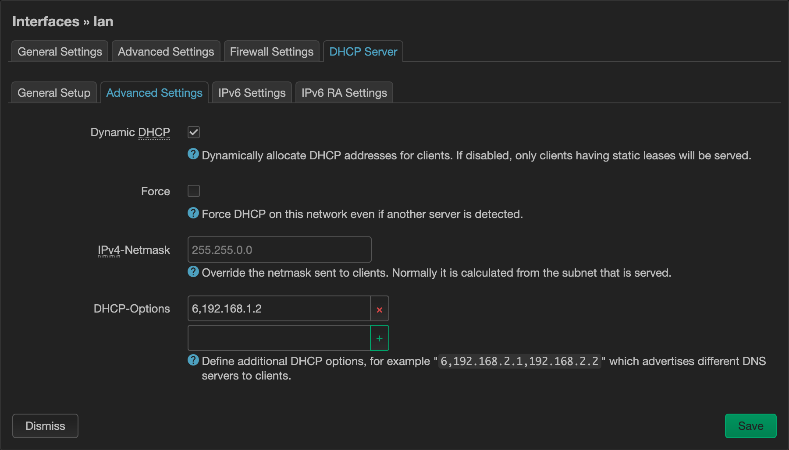
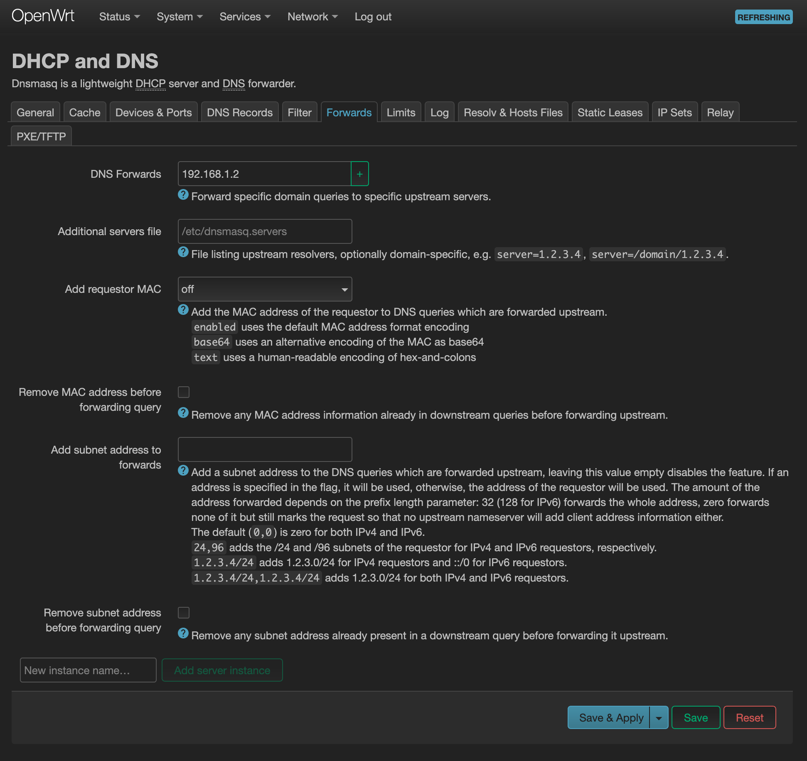

# OpenWrt

Here's a short guide to configure Pi-hole as the DNS server for your OpenWrt router. 
This guide was written for OpenWrt version 24.10 but the principle should hold for any earlier or later release although Web UI might look different. 

## Requirements

* OpenWrt router (already installed and accessible)
* Pi-hole installed on a device in your network (e.g. Raspberry Pi or LXC container)
* Access to OpenWrt LuCI Web Interface or SSH terminal

## Configuration

Ensure Pi-hole has a fixed IP. For example: `192.168.1.2`. 

### Option 1: Tell DHCP clients to use Pi-hole (Recommended)

#### Web UI: Network > Interfaces > LAN

For the selected interface, eg *lan*, click *Edit*. Then under *DHCP Server* > *Advanced settings* set *DHCP-Options*:

```
6,192.168.1.2
```

*Meaning: 6 = DNS server, followed by IP.*



#### Terminal:

    $ uci add_list dhcp.lan.dhcp_option='6,192.168.1.2'
    $ uci commit dhcp
    $ /etc/init.d/dnsmasq restart

### Option 2: Forward requests to Pi-hole
*Note: This makes all requests look like they come from the router in Pi-hole.*

#### Web UI: Network > DHCP and DNS > Forwards

Add your Pi-hole IP under DNS forwards



#### Terminal:

```
$ uci add_list dhcp.@dnsmasq[0].server='192.168.1.2'
$ uci commit dhcp
$ /etc/init.d/dnsmasq restart
```

### Restart Network Clients

Reboot your devices or release/renew their DHCP leases so they pick up the new DNS server. 

## Verification

On a client, run:

```
$ nslookup example.com
```

Ensure the server address is your Pi-hole IP.

```
Server:		192.168.1.2
Address:	192.168.1.2#53
````

Visit the Pi-hole dashboard at http://192.168.1.2/admin and check query log for activity. 
