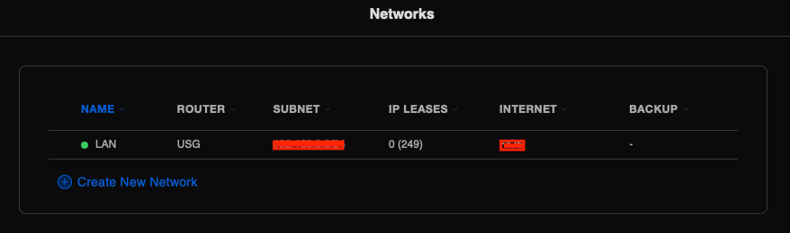
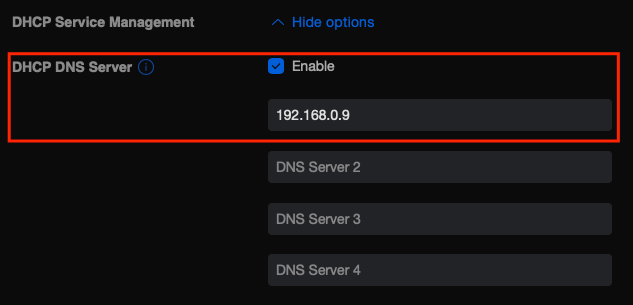
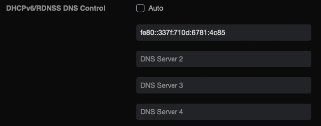
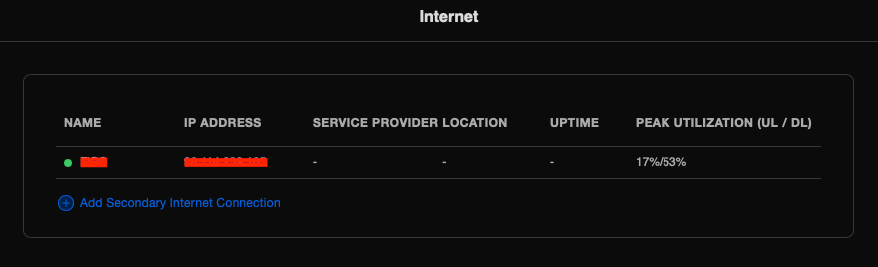
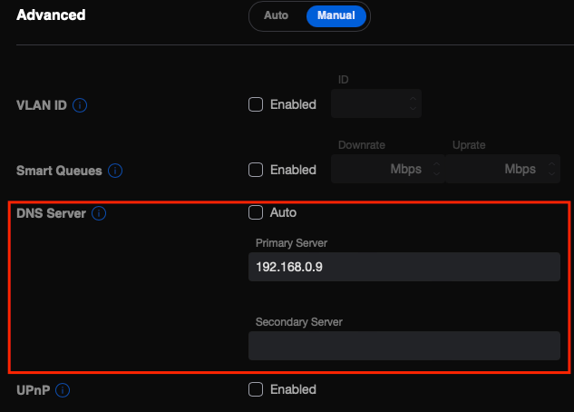

This guide was developed using a Ubiquiti Cloud Key v2 with UniFi Network v7.1.61. Following the first method below will have you adding your Pi-hole as a DNS server for all devices on your LAN. Following the second method below will have DNS queries route through your USG and then to your Pi-hole. Either option is valid, depending on your specific requirements, but it is recommended to choose one or the other - not both.

!!! note
    While this guide attempts to cover both IPv4 and IPv6, your mileage may vary.

### Grab your IPv4 and IPv6 address from your Raspi

SSH into your Raspi. A quick `ifconfig eth0` (substituting `eth0` for the applicable network interface) will get you the address information:

```
eth0: flags=4163<UP,BROADCAST,RUNNING,MULTICAST>  mtu 1500
        inet 192.168.0.9  netmask 255.255.255.0  broadcast 192.168.0.255
        inet6 2001:470:5:3::8ed  prefixlen 128  scopeid 0x0<global>
        inet6 2001:470:5:3:8d70:e92e:7030:6eef  prefixlen 64  scopeid 0x0<global>
        inet6 fe80::337f:710d:6781:4c85  prefixlen 64  scopeid 0x20<link>
        ether dc:a6:32:0e:31:2d  txqueuelen 1000  (Ethernet)
        RX packets 1297459  bytes 1279521260 (1.1 GiB)
        RX errors 0  dropped 0  overruns 0  frame 0
        TX packets 2315988  bytes 2766370095 (2.5 GiB)
        TX errors 0  dropped 0 overruns 0  carrier 0  collisions 0
```

Take note of the `inet` address, and the `inet6` address which starts with `fe` (denotes a local link or LAN address). Those are the IPs which you'll use as your DNS servers in the USG. For this example, we'll be using the `192.168.0.9` and `fe80::337f:710d:6781:4c85` IPs for the following directions.

### Method 1: Distribute Pi-hole as DNS server via DHCP

Choosing this option will have DNS queries taking the following path:

```
(Clients) -> Pi-hole -> Upstream DNS Server
```

Go to **Settings** --> **Networks** and click on the Network line that you want to modify:



Under **DHCP**, in the DHCP Server Management section click "Show options" to reveal the **DHCP DNS Server** section. Check the **Enable** box and enter your Raspi's IPv4 address here.



Scroll down to **IPv6**, and under the **DHCPv6/RDNSS DNS Control** section, uncheck **Auto** if it's enabled and enter Raspi's IPv6 address here. Click **Apply Changes** to have the settings persistently saved.



All client devices on your network should now automatically be configured with a single IPv4 and single IPv6 address for DNS resolution. If you don't see your client devices update quickly enough, you *can* toggle Wi-Fi off/on or disconnect the Ethernet cable for a couple of seconds and then reconnect it.

### Method 2: Using your Pi-hole as a resolve for your USG

If you'd rather have your USG forward all DNS traffic to Pi-hole, you can complete this *alternative* step. Doing so will have DNS queries taking the following path:

```
(Clients) -> USG -> Pi-hole -> Upstream DNS Server
```

!!! warning
    Keep in mind that if you are using your USG's IP address as an upstream resolver for your Pi-hole together with this configuration, ***this will cause a resolver loop***. Make sure to have another upstream DNS server(s) set in your Pi-hole's configuration, or use Pi-hole as [your own recursive DNS server with Unbound](https://docs.pi-hole.net/guides/dns/unbound/?h=unbound#configure-unbound).

Log into your Unifi Cloud Key. Go to **Settings** -> **Internet**. Click on the WAN line that appears.



Under **Advanced**, in the DNS Server section uncheck the Auto box and add your Raspi's IPv4 address. This allows your USG to use Pi-hole for all DNS lookups. Click **Apply Changes** to have the settings persistently saved.


